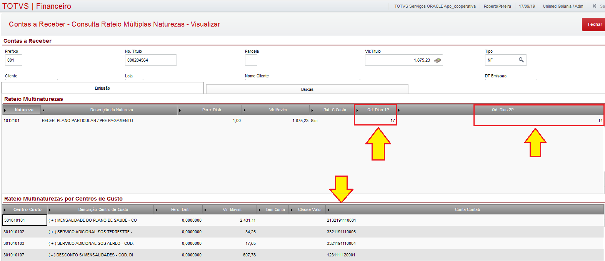

Nesta página vamos descrever as regras de contabilização das baixas de faturas que tiveram origem no SGU 2.0, serão criados lançamentos padrões para gerar os lançamentos, mas nesses LPs serão configurados para ser executada a rotina que contém as regras abaixo:

**01 - Criação dos lançamentos padrões**

Os LPs serão configurados para trabalhar 1 x n, ou seja, poderá ter um débito para vários créditos ou vice versa. Dessa forma a rotina customizada traz os seguintes dados na baixa:

01.1 - Conta contábil DÉBITO

01.2 - Conta contábil CRÉDITO

01.3 - Valor

01.4 - Histórico e Histórico Aglutinado

**02 - Número do lote contábil**

02.1 - Será utilizado o lote padrão do sistema 008850

**03 - Tipos de lançamentos contábeis** 

03.1 - CONTA DÉBITO - Utilizar a conta contábil que está definida no cadastro banco o qual recebeu o valor.

03.2 - CONTA CRÉDITO - Utilizar as contas contábeis que estão na tabela SEZ030, na coluna "Conta Contab" ( `SEZ->EZ_CONTA` ), exceto as contas contábeis de impostos.

Obs1. Caso os campos ("Qtd dias 1P" e "Qtd dias 2p") estejam iguais a zero (0) ou ("Qtd dias 2p" igual a zero (0)) , a conta crédito deve ser outra. Para obter essa outra conta, é necessário posicionar no cadastro de centro de custo, e pegar no campo "Cta CTB 02" ( `CTT->CTT_XCTA2` ).

Obs2. As contas contábeis que estão definidas no cadastro de centro de custos "Conta CTB 01" ( `CTT->CTT_XCTA1` ) são as contas transitórias ( faturamento antecipado, conforme ficou combinado com Leonardo 17/09/2019 ), exceto as de impostos. No cadastro do centro de custo há um campo para distinguir o que é imposto dos demais, o campo "Tipo produto" ( `CTT->CTT_XTPROD` ).

03.3 - CONTA CREDITO ( Impostos ), Utilizar as contas contábeis que estão na tabela SEZ030, na coluna "Conta Contab" ( `SEZ->EZ_CONTA` ).

Obs. A condição para gerar lançamentos contábeis referente aos impostos é somente se a baixa for total, ou seja, não tenha saldo no ( `SE1->E1_SALDO` ).

03.4 - ACRESCIMENTO e DECRÉSCIMO ??? ( definir com Leonardo )

