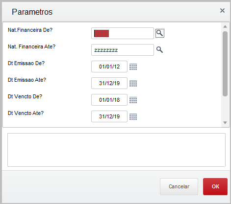
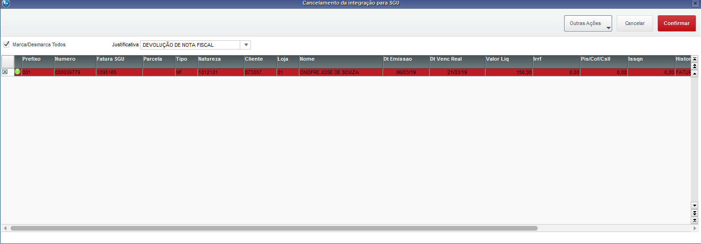
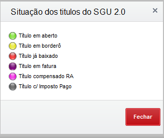

Nesta página descreveremos a rotina customizada para realizar o cancelamento da integração do SGU 2.0 para o ERP.

Existe uma tabela no SGU 2.0 ( INTGRA_SGU_ERP ) que contém os registros que estão prontos para integrar e também os que foram integrados. 

Sobre os registros que foram integrados, há situações em que precisam ser cancelados e/ou alterados no SGU 2.0. O SGU faz o controle dos registros através dessa tabela INTGRA_SGU_ERP, uma especie de fila. O qual somente libera o registro no SGU após o cancelamento.

Foi construída a rotina UAFIN022 onde é possível fazer o cancelamento de uma ou várias faturas do SGU 2.0, depende de como será utilizado o filtro e também a situação da fatura no ERP. Essa rotina está disponivel no modulo financeiro, menu padrão do sistema (SIGAFIN)em "Atualizações \ Integracao SGU \ Canc Int CtaRec ".

A primeira tela a ser exibida são as perguntas a serem utilizadas nos filtros:

| Pergunta| Resposta/obervação |
| ------ | ------ |
| Nat.Financeira De?  | < Informe ou selecione o código da natureza financeira inicial> |
| Nat.Financeira Até? | < Informe ou selecione o código da natureza financeira final> | 
| Dt Emissão De?      | < Informe a data inicial de emissão das faturas> |
| Dt Emissão Até?     | < Informe a data final  de emissão das faturas> |
| Dt Vencto De?       | < Informe a data de vencimento inicial das faturas |
| Dt Vencto Até?      | < Informe a data de vencimento final das faturas |
| Fatura SGU De?      | < Informe o numero inicial da fatura do SGU 2.0 | 
| Fatura SGU Até?     | < Informe o numero final da fatura do SGU 2.0 |

Obs. Os dados informados nas perguntas são acumulativos, e nunca deixar o parâmetro inicial e final em branco.

Aplicando os filtros, será exibida tela com os registros que atenderam aos critérios.

Para cancelar, deve marcar as faturas no botão check box no lado esquerdo. Escolher uma justificativa e clicar no botão "Confirmar".

Nesse momento o sistema fará a validação, caso a "bolinha" no canto esquerdo não estiver "verde". Não será feito o cancelamento.

Veja as legendas:

Se a "bolinha" estiver "verde", então será feito o cancelamento. Essa rotina acessa a tabela de integração do SGU 2.0 e localiza o registro e muda o status de "I" (integrado) "C" (Cancelado), além de outros campos; data do cancelamento, usuário que realizou o cancelamento e o motivo do cancelamento.