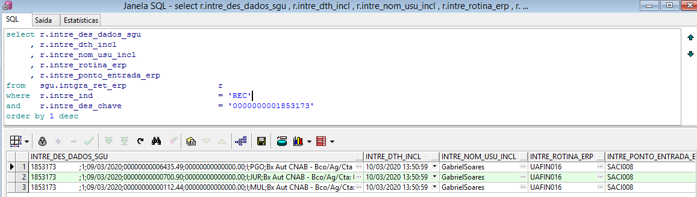
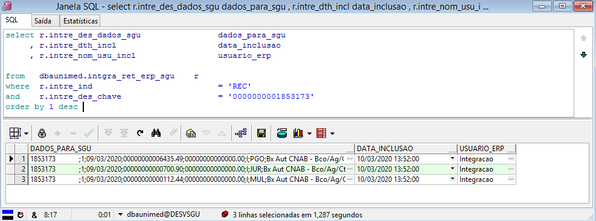

Nesta página vamos descrever os campos que são preenchidos na tabela "INTGRA_RET_ERP" que está no usuário/schema "SGU" no banco de dados do ERP.

Esta tabela é preenchida sempre que há alguma ação sobre registros "PAG", "REC","DEB" ou "PLA" no ERP. Os registros inseridos nela são enviados posteriormente para o sistema SGU através do JOB "J_P_INTGRA_ERP" que também está instalado no usuário "SGU" do banco ERP.

Os registros são inseridos com status "P" (pendente), o job processa os registros, ou seja, envia para a tabela de integração no banco de dados do SGU. Os registros são replicados na tabela "INTGRA_RET_ERP_SGU" no usuário/schema "dbaunimed", No banco de dados do SGU há um job que lê os registros pendentes de integração e faz os devidos processamentos. O job responsável por essa atividade no banco de dados do SGU 2.0 é o "J_P_PRCSSA_RET_INTGRA_ERP".

**Exemplo registro no banco ERP: Usuário/schema "SGU"**
---



```
select r.intre_des_dados_sgu                dados_para_sgu
     , r.intre_dth_incl                     data_inclusao
     , r.intre_nom_usu_incl                 usuario_erp
     , r.intre_rotina_erp                   rotina_erp
     , r.intre_ponto_entrada_erp            ponto_entrada_erp
from   sgu.intgra_ret_erp                   r
where  r.intre_ind                          = 'REC'
and    r.intre_des_chave                    = '0000000001853173'
order by 1 desc 
```


**Exemplo registro no banco SGU: Usuário/schema "DBAUNIMED"**
---



```
select r.intre_des_dados_sgu                dados_para_sgu
     , r.intre_dth_incl                     data_inclusao
     , r.intre_nom_usu_incl                 usuario_erp
     
from   dbaunimed.intgra_ret_erp_sgu    r
where  r.intre_ind                          = 'REC'
and    r.intre_des_chave                    = '0000000001853173'
order by 1 desc 
```