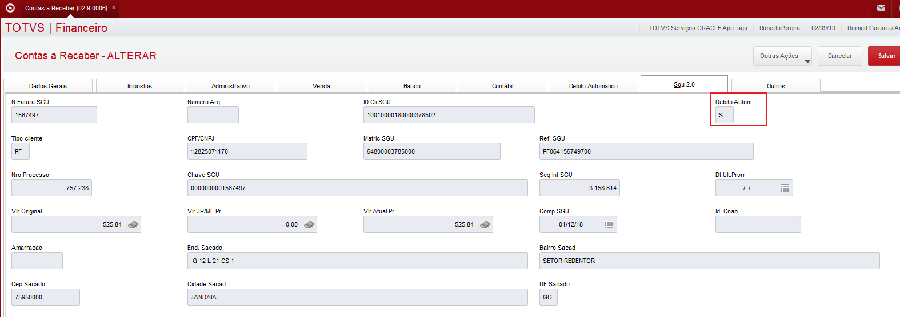

Nesta página vamos demonstrar o processo de agendamento das faturas que tiveram origem no SGU 2.0.

Após o cliente estar cadastrado no débito automático, no ERP e SGU 2.0, as próximas faturas que são geradas no SGU 2.0 e posteriormente integrada com o contas a receber do ERP, elas vem com um "flag" indicando que o cliente possui débito  automático.

Esses dados são gravados na tabela do contas a receber em campos específicos para o débito automático, veja a tela abaixo: (aba "Débito automático" e "SGU 2.0" )





O agendamento é feito através da geração de arquivo REMESSA  no leiaute FEBRABAN150, para isso foi criada a rotina UAFIN016, está disponível no modulo financeiro em "Atualizações \ Débito automático \ CTRL REM/RET ". Utilizar o botão  "FEBRABAN 150"


No final do processamento será exibida mensagem informando o caminho e nome dos arquivos gerados. A área responsável deve envia-los para o banco correspondente.

Consulta SQL:
````
SELECT SE1.*
FROM   SE1030                 SE1
WHERE  SE1.D_E_L_E_T_         = ' '
AND    SE1.E1_FILIAL          = '01'
AND    SE1.E1_XFATSGU        != ' '
AND    SE1.E1_SALDO          > 0
AND    SE1.E1_XDEBAUT        = 'S'
AND    SE1.E1_VENCREA        BETWEEN '20190801' AND '20190831'
````
