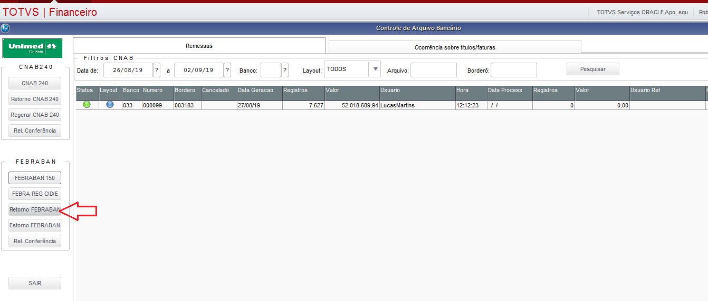
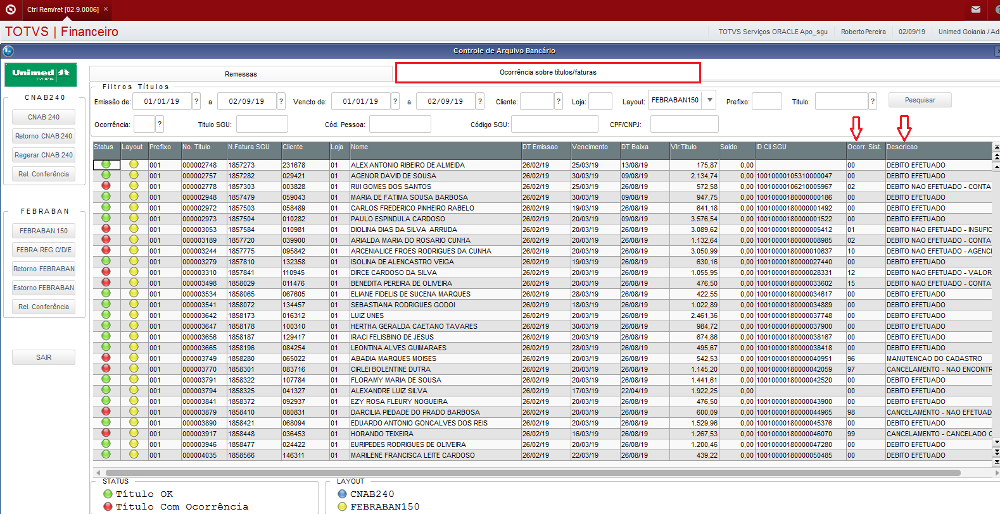
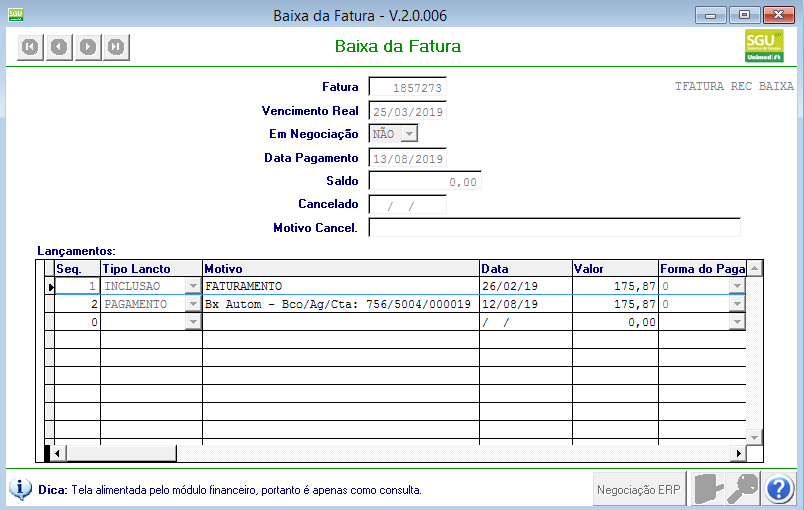
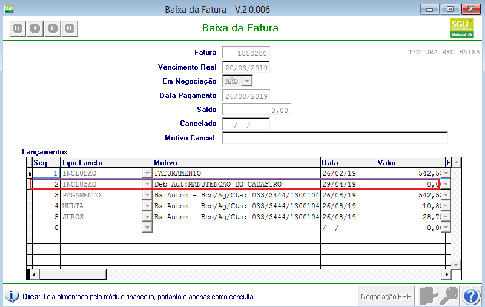

Nesta página vamos demonstrar o processamento de arquivos de "RETORNO" dos bancos conveniados. Esses arquivos de retorno estão no padrão FEBRABAN150 e neles podem ter vários tipos de registros, entre eles os principais são:

**Do banco para empresa**

| TIPO   | AÇÃO                        | Observações
| ------ | --------------------------- |-----------------------------------------------------------------------|
| "B"    | Pedido de inclusão/exclusão | A instrução de inclusão/exclusão está na coluna 150                   |
| "F"    | Retorno do débito automático| Confirmação de agendamento, debito efetivado ou não                   |
| "J"    | Confirmação recepção arquivo| Confirmação de recebimento de arquivo de remessa		       |

**Da empresa para banco**

| TIPO   | AÇÃO                        | Observações
| ------ | --------------------------- |-----------------------------------------------------------------------|
| "C"    | Ocorrências no cadastramento| Após o processamento do registro "B", a empresa envia quando tem erro |
| "E"    | Agendamento / Cadastramento | Envia as faturas para agendamento ou pedido de cadastro pela empresa  |
| "D"    | Cancelamento débito         | Envia instrução para cancelar o cadastro do débito no banco           |

A área responsável pelo contas a receber, acessa o canal de comunicação liberado pelo banco conveniado e faz o download dos arquivos de retorno.

Foi criada rotina para realizar o processamento dos arquivos de retorno e fazer as devidas validações, baixas. Essa rotina está no modulo financeiro em "Atualizações \ Débito automático \ CTRL REM/RET "

Utilizar o botão "Retorno FEBRABAN".  Os tipos de registros com instrução de baixa de fatura ou com ocorrências em faturas que são do SGU 2.0, a rotina envia os dados para a fila de integração ERP x SGU.

As faturas/títulos contidos no arquivo de retorno que foram processadas, é possível consultar a ocorrência encontrada e enviada para o banco.  Na mesma rotina onde se faz o processamento, há uma aba com o nome "Ocorrência  sobre títulos/faturas", onde há filtros que auxilia na consulta.

No sistema SGU 2.0 as ocorrências podem ser consultas no "Historico de baixas" da fatura, segue alguns exemplos:

**Baixa por arquivo retorno **

**Ocorrência no arquivo de retorno, fatura não baixada.**

