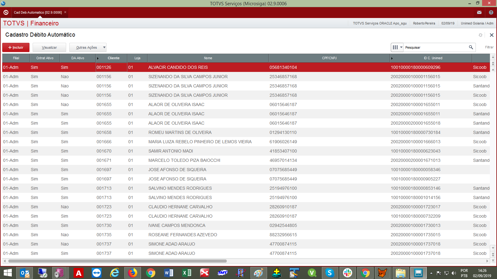
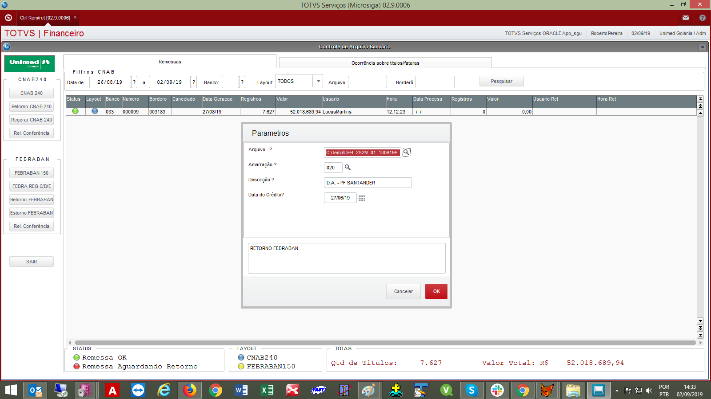
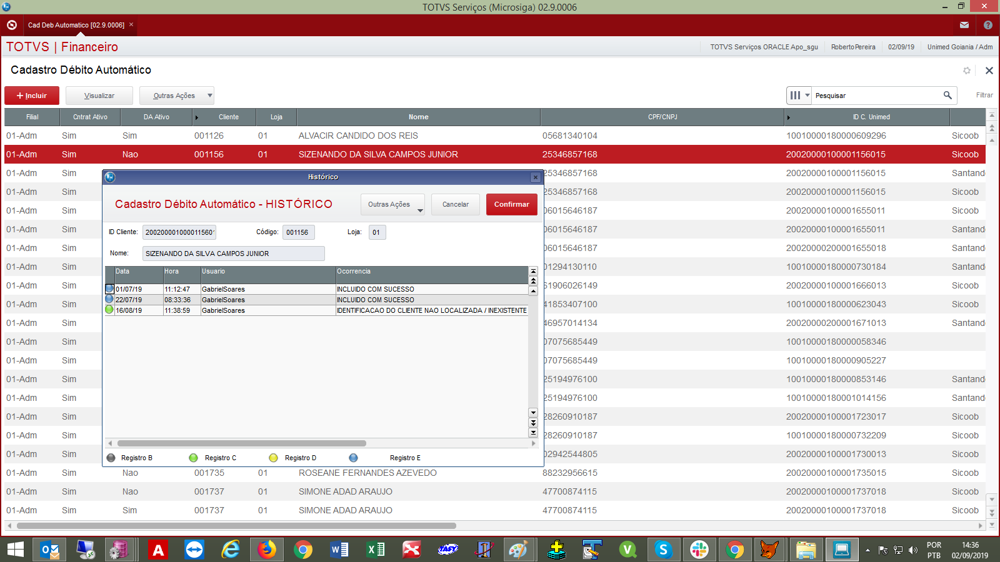
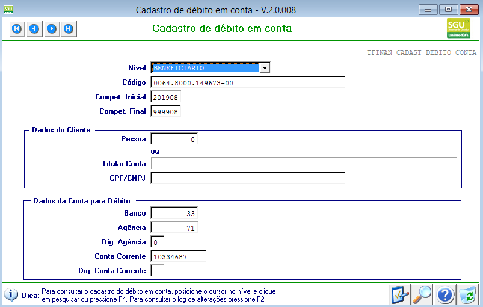

Nesta página vamos abordar as duas únicas forma de cadastro do débito automático; a primeira abordagem será o cadastro manual e última o cadastro automático.

**01 - Cadastro Manual**

Foi desenvolvida rotina para cadastramento do débito automático, ela está disponível no módulo financeiro em "Atualizações \ Débito automático \ Cad Déb Automático". Nessa rotina é possível fazer a inclusão manual do débito automático apenas de código identificador que não tem origem no SGU 2.0. Foi desenvolvida para o faturamento de MDEB e SEGURO Saúde, os quais possuem código de identificação diferente do SGU.

**02 - Cadastro automático ( arquivo de retorno do banco )**

Foi desenvolvida rotina de leitura dos arquivos de retornos dos bancos conveniados, os arquivos de retorno que possui registro do tipo "B", indica uma solicitação de cadastro pelo banco.  Esta rotina aceita pedidos de cadastros do SGU 2.0 e também dos produtos do ERP ( MDEB /SEG SAUDE).

Ao executar a rotina; são realizadas algumas validações, como código de identificação válido, beneficiário titular ativo e convênio bancário. Caso encontre algum problema, é gerado uma ocorrência com o motivo da não aceitação. ( ver item 03).

A rotina está disponível no módulo financeiro, em "Atualizações \ Débito automático \ CTRL REM/RET", utilizar o botão "Retorno FEBRABAN".

**03 - Consultar ocorrências no cadastro**
Na mesma rotina de cadastro manual citada item 01, é possível realizar a consulta das ocorrências no cadastro do débito automático. Ao acessar a rotina, no botão "Outras ações" há uma opção com o nome "Histórico", será exibida uma tela igual a esta:

**04 - Gerar arquivo C/D/E**

Após a realização das conferências, é o momento da conclusão do processo diário. A geração dos arquivos com instruções C/D/E é a ultima parte do processo. Ou seja, após o processamento citado no item 02 as ocorrências de rejeição são gravadas e para que o banco tome conhecimento das rejeições, é necessário a geração dos arquivos de retorno C/D/E e fazer a postagem no meio de comunicação disponibilizado pelo banco.

A geração do arquivo ocorre na mesma rotina de onde faz o processamento, item 02. Apenas o botão é diferente, nesse caso deve-se utilizar "FEBRA REG C/D/E".

**05 - Integração do cadastro ERP com SGU**

Os cadastros efetuados com sucesso no ERP e que possuem código de identificador do SGU, estes são enviados no leiaute "DEB" cedido pelo fornecedor do sistema SGU 2.0

A dinâmica ocorre da seguinte forma; ao processar a rotina de leitura do arquivo de retorno do banco, no padrão FEBRABAN. E não tendo inconsistências ( ocorrências ), o cadastro recebe um flag de "provisório", posteriormente via job de banco de dados no ERP esse cadastro é enviado para o SGU e aguardar a aceitação do SGU.

Essa "aceitação" do SGU ocorre após o envio dos dados no leiaute "DEB" disponibilizado pelo fornecedor do sistema SGU 2.0, num segundo momento via job de banco de dados é verificado o registro se foi aceito ou não. Se aceito, o cadastro que estava com o flag "provisório" no ERP, muda-se o flag para definitivo. Caso contrário, é enviado e-mail para os responsáveis pelo débito automático ( informando da inconsistência, esse e-mail é enviado pelo menos uma vez no dia, até que seja fornecida solução.

Tela de cadastro aceito pelo SGU: ( Faturamento \ Cadastro \ Débito em conta )

**05.1 - Rotina de envio de dados no leiaute "DEB" para o SGU 2.0**

Foi criada uma *procedure* no banco de dados do ERP, no usuário/schema "SGU" com o nome "P_INTGRA_DEB_AUTM_ERP_SGU". Ela lê os registros no cadastro do débito automático do ERP que estão com situação "P" (provisoria) e envia para a tabela "INTGRA_RET_ERP" no leiaute "DEB".

Essa *procedure* é executado de forma automática, através do JOB "J_P_INTGRA_DEB_AUTM_ERP_SGU". Este está programado para realizar várias execuções diárias.

**05.2 - Rotina de verificação da aceitação dos dados no SGU 2.0**

A verificação da "aceitação" do cadastro pelo SGU é feita também pela *procedure* citada no item anterior 05.1 e mesmo JOB.

A ação da rotina é; se o cadastro foi aceito com sucesso no SGU, ela atualiza o registro no cadastro do débito automático no ERP de "provisório" para "integrado".

Caso tenha rejeição, o registro no cadastro do débito automático no ERP continua como "provisório" e é enviado e-mail para lista de pessoas responsáveis pelo débito automático na UD Goiânia, informando os dados inconsistentes. Isso é feito uma vez no dia

O fato do registro ficar com status "provisório" no cadastro do débito automático no ERP, todo dia fará a tentativa de efetuar com sucesso. 
