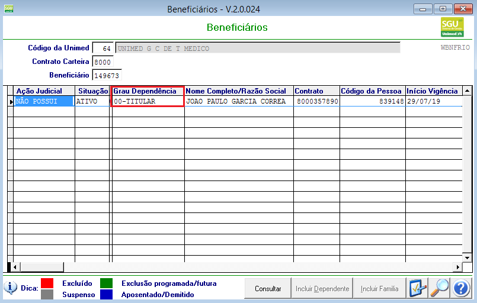
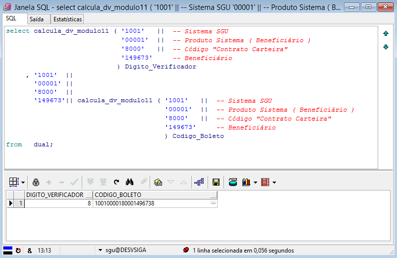

Nesta página, descrevemos informações relativas ao cadastro do titular de contrato pessoa física no SGU 2.0. Entendemos que é necessário para melhor compreensão sobre a solução desenvolvida para atender o cadastro do débito automático.

**Premissa** :  Todo contrato de pessoa física deve ter um beneficiário titular, não há exceção. Mesmo que tenha sido feita a troca de titularidade, sempre existirá um beneficiário titular no contrato.

No SGU 2.0 há o programa de consulta dos dados de beneficiário, está disponível em " Cadastro / Consultas / Beneficiários ", para mais detalhes consulte o manual do sistema http://sgudoc.fescsaude.com.br/index.php/PCON_BNFRIO

**Exemplo:**




**Dicas:**

01 - Os contratos de clientes pessoa física possui no campo "Contrato carteira" a informação "8000". Já os clientes que são aposentados ou demitidos ( Inativo ), esse código é diferente de "8000".

02 - Foi definida a seguinte regra para o **CÓDIGO DE IDENTIFICAÇÃO PARA DÉBITO AUTOMÁTICO**. Sua composição é feita por 20 ( vinte ) caracteres numéricos, os quais correspondem: ( Esse código é impresso no boleto/fatura do cliente, a emissão é feita pelo SGU 2.0)

| Inicio| Fim  | Descrição                                                                                         |
| ----- | ---- |---------------------------------------------------------------------------------------------------|
| 1º    | 4º   | Identifica o sistema, no caso SGU 2.0 é igual a "1001"                                            |
| 5º    | 9º   | Identifica o produto do sistema, no caso, Beneficiário titular = "00001"                          |
|10º    | 13º  | Identifica o código "Contrato carteira", Beneficiário PF = "8000", aposentado/demitido <> "8000"  |
|14º    | 19º  | Identifica o código da família.                                                                   |
|20º    | 20º  | Digito verificador, cálculo utilizando modulo 11 considerando 1º ao 19º                           |



A função "calcula_dv_modulo11" está disponivel no schema "DBAUNIMED" no banco de dados SGU, e também no banco de dados do ERP com o mesmo nome, no schema SGU.

````
select calcula_dv_modulo11 ( '1001'   ||  -- Sistema SGU
                             '00001'  ||  -- Produto Sistema ( Beneficiário )
                             '8000'   ||  -- Código "Contrato Carteira"
                             '149673'     -- Beneficiário
                            ) Digito_Verificador
     , '1001'  ||
       '00001' ||
       '8000'  ||
       '149673'|| calcula_dv_modulo11 ( '1001'   ||  -- Sistema SGU
                                        '00001'  ||  -- Produto Sistema ( Beneficiário )
                                        '8000'   ||  -- Código "Contrato Carteira"
                                        '149673'     -- Beneficiário
                                        ) Codigo_Boleto
from   dual;
````