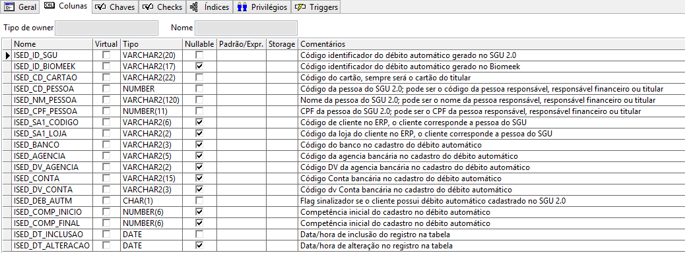
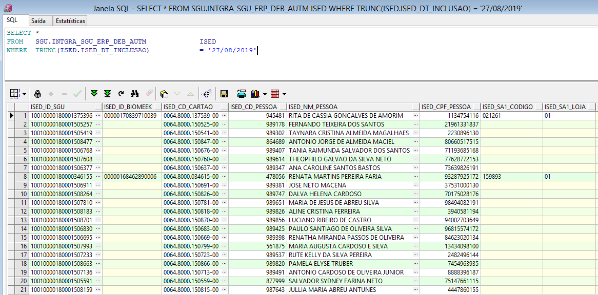
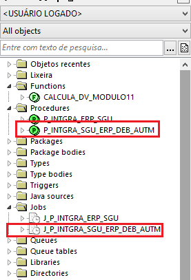

Nesta página vamos apresentar a solução desenvolvida para a disponibilização dos dados de clientes pessoa física, aposentado ou demitido para o ERP.

Foi criado o usuário/schema no banco de dados do ERP com o nome "SGU", nele estão vários objetos de banco de dados que são utilizados pelo ERP. O objetivo desses objetos é manter os dados mínimos do SGU 2.0 em tabela no banco de dados do ERP, dessa forma garantindo a independência do ERP na execução de suas rotinas.

Abaixo os objetos criados:

**01 - Tabela INTGRA_SGU_ERP_DEB_AUTM**





````
SELECT *
FROM   SGU.INTGRA_SGU_ERP_DEB_AUTM             ISED
WHERE  TRUNC(ISED.ISED_DT_INCLUSAO)            = '27/08/2019'

````

**02 - Procedure P_INTGRA_SGU_ERP_DEB_AUTM**

Esta procedure faz a verificação no banco de dados do SGU 2.0 dos novos titulares, alterações de titularidade e exclusão do titular e atualiza os dados na tabela "INTGRA_SGU_ERP_DEB_AUTM".



**03 - Job J_P_INTGRA_SGU_ERP_DEB_AUTM**

Este job faz a execução automática da procedure "P_INTGRA_SGU_ERP_DEB_AUTM", inicialmente foi programado para ser executado todos os dias, às 5h da manhã.


