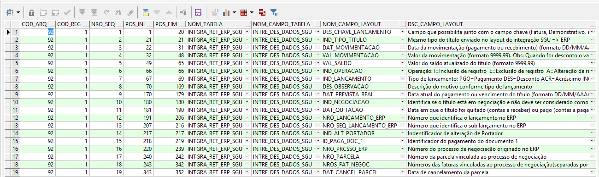

Nessa página vamos descrever os programas que foram criados ( customização ) e também os padrões do fornecedor do sistema ERP com seus respetivos pontos de entradas para que ocorram o envio de dados do contas a receber do ERP para o SGU 2.0

Observação.: Ponto de entrada no ERP, são trechos no código fonte do fornecedor onde o cliente (UD Goiânia) pode escrever/customizar para realizar determinada tarefa no sistema.

**Índice**

**01 - ABATIMENTO (AB-)**

01.1 - Inclusão de AB-

01.2 - Exclusão de AB-

**02 - BAIXA DE TITULO NO CONTAS A PAGAR**

02.1 - Baixa manual

02.3 - Baixa automática por borderô

02.4 - Baixa automática por arquivo retorno bancário : CNAB240

02.6 - Excluir baixa

02.7 - Cancelar baixa

02.8 - Compensação de adiantamento ( PA )

02.9 - Cancelar compensação de adiantamento ( PA )

**03 - CANCELAMENTO DA INTEGRAÇÃO**

03.1 - Cancela Integração Ctas Pagar

**04 - DADOS NA FILA DE INTEGRAÇÃO COM SGU ( SGU.INTGRA_ERP_SGU )**

04.1 - Exemplo de inclusão AB-

04.2 - Exemplo de exclusão AB-

04.3 - Exemplo de baixa

04.4 - Exemplo de cancelamento/exclusão de baixa

**05 - LEIAUTE DE INTGRAÇÃO ERP x SGU**

05.1 - Leiaute REEMBOLSO

```
SELECT  PR.*
      , PS.COMAND_SQL
      , CURSOR ( SELECT *
                   FROM  DBAUNIMED.PTU_LAYOUT_DET PLD
                  WHERE  PLD.COD_ARQ = PS.COD_ARQ
                    AND  PLD.COD_REG = PS.COD_REG
                  ORDER  BY 1,2,3 )                             LAYOUT
FROM   PTU_LAYOUT_SQL PS
      ,PTU_LAYOUT_REG PR     
WHERE  PR.COD_ARQ = PS.COD_ARQ
AND    PR.COD_REG = PS.COD_REG
--> 91 (ENVIO SGU X ERP) 92 (RETORNO ERP X SGU)
AND    PS.COD_ARQ = 92
--> LEIAUTE DE FATURA PESSOA FISICA
AND    PR.SIG_REG = 'INTRE_REE'
ORDER  BY 1, 2
```

05.2 - Leiaute REMOÇAO

```
SELECT  PR.*
      , PS.COMAND_SQL
      , CURSOR ( SELECT *
                   FROM  DBAUNIMED.PTU_LAYOUT_DET PLD
                  WHERE  PLD.COD_ARQ = PS.COD_ARQ
                    AND  PLD.COD_REG = PS.COD_REG
                  ORDER  BY 1,2,3 )                             LAYOUT
FROM   PTU_LAYOUT_SQL PS
      ,PTU_LAYOUT_REG PR     
WHERE  PR.COD_ARQ = PS.COD_ARQ
AND    PR.COD_REG = PS.COD_REG
--> 91 (ENVIO SGU X ERP) 92 (RETORNO ERP X SGU)
AND    PS.COD_ARQ = 92
--> LEIAUTE DE FATURA PESSOA FISICA
AND    PR.SIG_REG = 'INTRE_REM'
ORDER  BY 1, 2
```

05.3 - Leiaute RESTITUIÇÃO DE VALORES

```
SELECT  PR.*
      , PS.COMAND_SQL
      , CURSOR ( SELECT *
                   FROM  DBAUNIMED.PTU_LAYOUT_DET PLD
                  WHERE  PLD.COD_ARQ = PS.COD_ARQ
                    AND  PLD.COD_REG = PS.COD_REG
                  ORDER  BY 1,2,3 )                             LAYOUT
FROM   PTU_LAYOUT_SQL PS
      ,PTU_LAYOUT_REG PR     
WHERE  PR.COD_ARQ = PS.COD_ARQ
AND    PR.COD_REG = PS.COD_REG
--> 91 (ENVIO SGU X ERP) 92 (RETORNO ERP X SGU)
AND    PS.COD_ARQ = 92
--> LEIAUTE DE FATURA PESSOA FISICA
AND    PR.SIG_REG = 'INTRE_RVB'
ORDER  BY 1, 2
```

05.4 - Leiaute CONTAS PAGAR

```
SELECT  PR.*
      , PS.COMAND_SQL
      , CURSOR ( SELECT *
                   FROM  DBAUNIMED.PTU_LAYOUT_DET PLD
                  WHERE  PLD.COD_ARQ = PS.COD_ARQ
                    AND  PLD.COD_REG = PS.COD_REG
                  ORDER  BY 1,2,3 )                             LAYOUT
FROM   PTU_LAYOUT_SQL PS
      ,PTU_LAYOUT_REG PR     
WHERE  PR.COD_ARQ = PS.COD_ARQ
AND    PR.COD_REG = PS.COD_REG
--> 91 (ENVIO SGU X ERP) 92 (RETORNO ERP X SGU)
AND    PS.COD_ARQ = 92
--> LEIAUTE DE FATURA PESSOA FISICA
AND    PR.SIG_REG = 'INTRE_PAG'
ORDER  BY 1, 2
```

OBS. Executar o script numa conexão com banco de dados DBSGU, e na coluna "layout" contém os dados que serão manipulados no SGU 2.0

