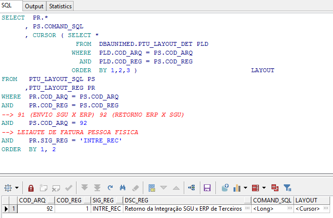
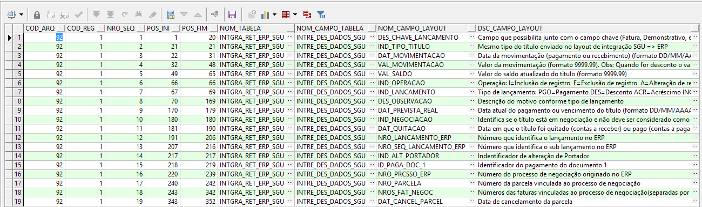

Nessa página vamos descrever os programas que foram criados ( customização ) e também os padrões do fornecedor do sistema ERP com seus respetivos pontos de entradas para que ocorram o envio de dados do contas a receber do ERP para o SGU 2.0

Observação.: Ponto de entrada no ERP, são trechos no código fonte do fornecedor onde o cliente (UD Goiânia) pode escrever/customizar para realizar determinada tarefa no sistema.

**Índice**

**01 - DESCONTO / ABATIMENTO (AB-)**

[01.1 - Inclusão de AB-](https://labs.unimedgoiania.coop.br/ti/setsis/desenvolvimento/protheus/protheus-unimed/wikis/ERPxSGUCtasRecAB)

[01.2 - Exclusão de AB-](https://labs.unimedgoiania.coop.br/ti/setsis/desenvolvimento/protheus/protheus-unimed/wikis/ERPxSGUCtasRecAB)

**02 - BAIXA DE TITULO NO CONTAS A RECEBER**

02.1 - [Baixa/Estorno manual](https://labs.unimedgoiania.coop.br/ti/setsis/desenvolvimento/protheus/protheus-unimed/-/wikis/ERPxSGUCtasRecBXM)

02.2 - [Baixa/Estorno manual por arquivo CSV](https://labs.unimedgoiania.coop.br/ti/setsis/desenvolvimento/protheus/protheus-unimed/-/wikis/ERPxSGUCtasRecBXC)

02.3 - [Baixa/Estorno automática por borderô](https://labs.unimedgoiania.coop.br/ti/setsis/desenvolvimento/protheus/protheus-unimed/-/wikis/ERPxSGUCtasRecBXB)

02.4 - [Baixa/Estorno automática por arquivo retorno bancário : CNAB240 / FEBRABAN150](https://labs.unimedgoiania.coop.br/ti/setsis/desenvolvimento/protheus/protheus-unimed/-/wikis/ERPxSGUCtasRecBXN)

02.6 - Excluir a baixa  --> (Esta função foi desabilitada no sistema conforme definição analistas das áreas financeira e contábil).

02.8 - [Contabilização da baixa/estorno](https://labs.unimedgoiania.coop.br/ti/setsis/desenvolvimento/protheus/protheus-unimed/wikis/CTBACfgLPCtasRec)


**03 - CANCELAMENTO DA INTEGRAÇÃO**

03.1 - [Cancela Integração Ctas Receber](https://labs.unimedgoiania.coop.br/ti/setsis/desenvolvimento/protheus/protheus-unimed/wikis/CtasRecCancInt)

**04 - DADOS NA FILA DE INTEGRAÇÃO COM SGU ( SGU.INTGRA_ERP_SGU )**

04.1 - [Exemplo de baixa/estorno de fatura](https://labs.unimedgoiania.coop.br/ti/setsis/desenvolvimento/protheus/protheus-unimed/wikis/CtasRecERPxSGUCanFAT)

**05 - LEIAUTES DE INTGRAÇÃO ERP x SGU**

05.1 - Script para consultar LEIAUTE DE INTEGRACAO ERP x SGU

```
SELECT  PR.*
      , PS.COMAND_SQL
      , CURSOR ( SELECT *
                   FROM  DBAUNIMED.PTU_LAYOUT_DET PLD
                  WHERE  PLD.COD_ARQ = PS.COD_ARQ
                    AND  PLD.COD_REG = PS.COD_REG
                  ORDER  BY 1,2,3 )                             LAYOUT
FROM   PTU_LAYOUT_SQL PS
      ,PTU_LAYOUT_REG PR     
WHERE  PR.COD_ARQ = PS.COD_ARQ
AND    PR.COD_REG = PS.COD_REG
--> 91 (ENVIO SGU X ERP) 92 (RETORNO ERP X SGU)
AND    PS.COD_ARQ = 92
--> LEIAUTE DE FATURA PESSOA FISICA
AND    PR.SIG_REG = 'INTRE_REC'
ORDER  BY 1, 2
```



**Leiaute ( 10/06/2020 )**



