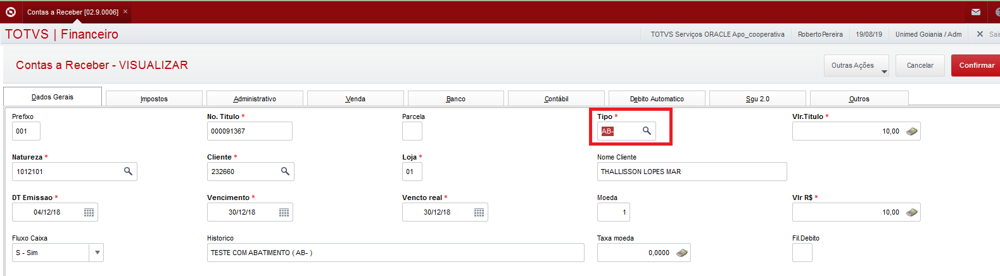

Nessa página vamos descrever as customizações feitas para que ocorram as integrações das faturas receber com o SGU 2.0, primeiramente será feita inclusão de um abatimento (AB-) sobre uma fatura que teve origem no SGU. Depois, será feito o processo de reversão, ou seja, fazendo o cancelamento do abatimento (AB-).

Obs. no ERP da TOTVS, somente é possivel fazer a inclusão de apenas um AB-, caso tenha a necessidade de fazer mais um, deve fazer a exclusão do antigo e somar os valores. É uma restrição do fornecedor do ERP.

**01.1 - Inclusão de abatimento/descontro ( AB- )**

Acessar o programa "Contas a receber", em "Atualizações \ Contas a receber \ Contas a receber" ou "Atualizações \ Contas a receber \ Funções contas a receber".

Selecionar o titulo que será feito o abatimento, apenas posicione sobre o titulo e utilize o botão "incluir". Abaixo um vídeo demonstrando o procedimento:

[Video_InclusãoDeAbatimento_AB-_.wmv](uploads/62d883834838dec9d71551cfd210ca64/Video_InclusãoDeAbatimento_AB-_.wmv)

Ao realizar essa ação no ERP, ele vai enviar os dados referente ao abatimento para o SGU 2.0 através do ponto de entrada [FA040INC.PRW ](https://labs.unimedgoiania.coop.br/ti/setsis/desenvolvimento/protheus/protheus-unimed/blob/master/ProjetoDebitoAutomatico/Financeiro/PontoEntrada/FA040INC.prw)( acessar o programa fonte acesse [aqui ](https://labs.unimedgoiania.coop.br/ti/setsis/desenvolvimento/protheus/protheus-unimed/blob/master/ProjetoDebitoAutomatico/Financeiro/PontoEntrada/FA040INC.prw)).

**01.2 - Exclusão de abatimento/desconto ( AB- )**

Acessar o programa "Contas a receber", em "Atualizações \ Contas a receber \ Contas a receber" ou "Atualizações \ Contas a receber \ Funções contas a receber".

Selecionar o titulo que foi feito o abatimento, apenas posicione sobre o titulo e utilize o botão "excluir". Abaixo um vídeo demonstrando o procedimento:

[Video_ExclusãoDeAbatimento_AB-_.wmv](uploads/4b3c111836a3a394b2da9b2636b3bbc2/Video_ExclusãoDeAbatimento_AB-_.wmv)

Ao realizar essa ação no ERP, ele vai enviar os dados referente a exclusão do abatimento para o SGU 2.0 através do ponto de entrada [FA040DEL.PRW](https://labs.unimedgoiania.coop.br/ti/setsis/desenvolvimento/protheus/protheus-unimed/blob/master/ProjetoHOMOLOGA/ProjetoSGU%202.0/Financeiro/PontoEntrada/FA040DEL.PRW) ( Acessar o programa fonte [aqui](https://labs.unimedgoiania.coop.br/ti/setsis/desenvolvimento/protheus/protheus-unimed/blob/master/ProjetoHOMOLOGA/ProjetoSGU%202.0/Financeiro/PontoEntrada/FA040DEL.PRW) )