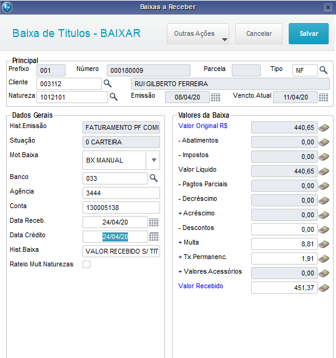

Nesta página vamos descrever o processo de baixa manual, esta rotina é padrão do sistema ERP Protheus.  A rotina padrão está disponível no ERP, em "Atualizações \ Contas à Receber \ Funções contas a receber" e também "Atualizações \ contas a receber \ Baixas a receber".

Nas rotinas padrões do sistema, há pontos de entrada; esses pontos são funções das quais podemos inserir códigos para realizar ações pela rotina padrão. Nesse caso, utilizamos os seguintes pontos de entrada para enviar dados para o SGU 2.0, são eles:

1 - Baixa : 
    **SACI008.PRW**, ver o código clique [aqui](https://labs.unimedgoiania.coop.br/ti/setsis/desenvolvimento/protheus/protheus-unimed/-/blob/master/ProjetoUNIMED/Financeiro/PontoEntrada/SACI008.prw)

2 - Estorno Baixa : 
    **FA070CA2.PRW**, ver o código clique [aqui](https://labs.unimedgoiania.coop.br/ti/setsis/desenvolvimento/protheus/protheus-unimed/-/blob/master/ProjetoHOMOLOGA/ProjetoSGU%202.0/Financeiro/PontoEntrada/FA070CA2.PRW)

Tela da rotina de baixa/estorno:

