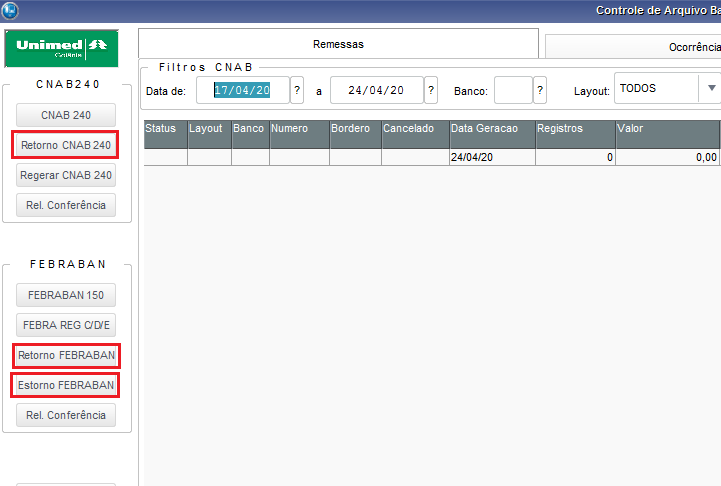

Nesta página vamos descrever o processo de baixa automática utilizando arquivo CNAB240 ou FEBRAN150, esta rotina foi customizada no sistema ERP Protheus.  Essa rotina está disponível no ERP, em "Atualizações \ Débito Automático \ CRTL REM/RET "

Esta rotina (UAFIN016) utiliza-se do recurso MSExecAuto, ou seja, ela lê os registros que estão num arquivo RET e faz a baixa dos registros que estiverem com os dados corretos, como se fosse utilizado a rotina padrão disponivel em "Atualizações \ Comunic.Bancária \ Retorno de cobranças".

Nas rotinas padrões do sistema, há pontos de entrada; esses pontos são funções das quais podemos inserir códigos para realizar ações pela rotina padrão. Nesse caso, utilizamos os seguintes pontos de entrada para enviar dados para o SGU 2.0, são eles:

1 - Baixa : 
    **SACI008.PRW**, ver o código clique [aqui](https://labs.unimedgoiania.coop.br/ti/setsis/desenvolvimento/protheus/protheus-unimed/-/blob/master/ProjetoUNIMED/Financeiro/PontoEntrada/SACI008.prw)

2 - Estorno Baixa : 
    **FA070CA2.PRW**, ver o código clique [aqui](https://labs.unimedgoiania.coop.br/ti/setsis/desenvolvimento/protheus/protheus-unimed/-/blob/master/ProjetoHOMOLOGA/ProjetoSGU%202.0/Financeiro/PontoEntrada/FA070CA2.PRW)

Tela da rotina customizada: ( Baixa / Estorno )

