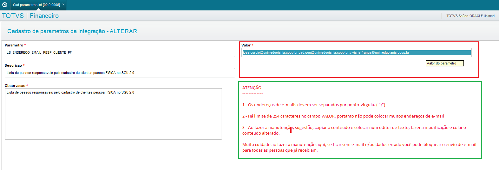

Nesta página vamos descrever em quais situações serão enviadas e-mails de notificação aos usuários dos sistemas SGU 2.0 e ERP quando ocorrer alguma falha no processo de integração entre os sistemas. Vamos começar pelas listas de e-mails; cadastramentos de e-mails e manutenções desses cadastros, quando ocorre o envio do e-mail de notificação de erro na integração do SGU 2.0 para o ERP e por último a integração de volta, ou seja, quando há alguma ação sobre a fatura a receber ou no contas à pagar e houve erro na integração do ERP para SGU 2.0.

# Índice

1.  [Cadastro de e-mails nas listas](https://labs.unimedgoiania.coop.br/ti/setsis/desenvolvimento/protheus/protheus-unimed/-/wikis/EmailErroIntgra#1-cadastro-de-e-mails-nas-listas)

2.  [Integração do SGU 2.0 para ERP](https://labs.unimedgoiania.coop.br/ti/setsis/desenvolvimento/protheus/protheus-unimed/-/wikis/EmailErroIntgra#2-integra%C3%A7%C3%A3o-do-sgu-20-para-erp)  

3.  [Integração do ERP para SGU 2.0](https://labs.unimedgoiania.coop.br/ti/setsis/desenvolvimento/protheus/protheus-unimed/-/wikis/EmailErroIntgra#3-integra%C3%A7%C3%A3o-do-erp-para-sgu-20)  

4.  [AVISO DE PROVIDÊNCIA](https://labs.unimedgoiania.coop.br/ti/setsis/desenvolvimento/protheus/protheus-unimed/-/wikis/EmailErroIntgra#4-aviso-de-providencia)


# 1. Cadastro de e-mails nas listas

Existem várias listas de endereços de e-mails, elas foram criadas para atender às áreas de negócio e suas operações nos sistema. Na implantação do sistema SGU 2.0 foram criadas as listas abaixo e cada área de negócio indicou quais contas de e-mails deveriam constar.

| NOME DA LISTA                                      | ÁREA DE NEGÓCIO 				                                      |
| -------------------------------------------------- | ------------------------------------------------------------------ |
| LS_ENDERECO_EMAIL_RESP_CLIENTE_PF                  | Gerência de Mercado												  |
| LS_ENDERECO_EMAIL_RESP_CLIENTE_PJ                  | Gerência de Mercado												  |
| LS_ENDERECO_EMAIL_RESP_CLIENTE_UN                  | Gerência Financeira												  |
| LS_ENDERECO_EMAIL_RESP_FIN_CTAS_PAGAR              | Gerência Financeira												  |
| LS_ENDERECO_EMAIL_RESP_FORNECE_COOPERADO           | Gerência Relacionamento Cooperado								  |  
| LS_ENDERECO_EMAIL_RESP_FORNECE_PRESTADOR           | Gerência Relacionamento Prestador								  |
| LS_ENDERECO_EMAIL_RESP_FORNECE_REEMBOLSO           | Gerência de Contas Médicas										  |
| LS_ENDERECO_EMAIL_RESP_FORNECE_RESTITUICAO         | Gerência De Mercado e Financeiro									  |
| LS_ENDERECO_EMAIL_RESP_FORNECE_UNIMED              | Gerência De Mercado e Contas Médicas								  |
| LS_ENDERECO_EMAIL_RESPONSAVEIS_DEBITO_AUTOMATICO   | Gerência De Mercado e Financeiro									  |
| LS_ENDERECO_EMAIL_RESPONSAVEIS_INTEGRACAO_CLIENTES | Gerência De Mercado e Financeiro									  |
| LS_ENDERECO_EMAIL_RESPONSAVEIS_INTEGRACAO_FATURAS  | Gerência De Mercado e Financeiro									  |
| LS_ENDERECO_EMAIL_RESPONSAVEIS_INTEGRACAO_FORNECED | Gerência Relacionamento Cooperado e Prestador					  |
| LS_ENDERECO_EMAIL_RESPONSAVEIS_INTEGRACAO_PAGAMENT | Gerência Relacionamento Cooperado, Prestador e Contas Médicas	  |
| LS_ENDERECO_EMAIL_RESPONSAVEIS_INTEGRACAO_SETCON   | Gerência de planejamento e controle orçamentário					  |
| LS_ENDERECO_EMAIL_RESP_PAGTO_COOPERADO             | Gerência Relacionamento Cooperado, Prestador e Contas Médicas	  |
| LS_ENDERECO_EMAIL_RESP_PAGTO_PRESTADOR             | Gerência Relacionamento Cooperado, Prestador e Contas Médicas	  |
| LS_ENDERECO_EMAIL_RESP_PAGTO_REEMBOLSO             | Gerência de Contas Médicas										  |
| LS_ENDERECO_EMAIL_RESP_PAGTO_RESTITUICAO           | Gerência de Mercado e Financeira									  |
| LS_ENDERECO_EMAIL_RESP_PAGTO_UNIMED                | Gerência de Mercado e Contas Médicas								  |
| LS_ENDERECO_EMAIL_RESP_RECEBER_PF                  | Gerência Financeira												  |
| LS_ENDERECO_EMAIL_RESP_RECEBER_PJ                  | Gerência Financeira												  |
| LS_ENDERECO_EMAIL_RESP_RECEBER_UN                  | Gerência Financeira												  |
| LS_ENDERECO_EMAIL_SUPORTE_TI                       | Gerência Tecnologia da informação 								  |

Script para obter lista atualizada:

```
select z99.z99_parame         nome_lista
     , Z99.*
from   z99030                 z99
where  z99.d_e_l_e_t_         = ' '
and    z99.z99_filial         = '01'
and    z99.z99_parame         like '%MAIL%'
order by 1
```

As listas foram criadas no sistema Protheus ( ERP ) e o acesso é feito nos módulos financeiro e contábil por colaboradores que possui perfil de "coordenação" ( acesso completo à todas as funções do sistemas ). 

Antes de acessar a rotina, você precisará do nome da lista que precisa fazer a manutenção. Então, o nome dessa lista está nos e-mails enviados, por exemplo este e-mail abaixo: ( Sempre que for pedida manutenção, peça pra anexar no chamado o modelo do e-mail, isso vai facilitar a identificação ).


Com o nome da lista identificada, deve acessar o programa para a manutenção. O caminho está em "Atualizações \ Integração SGU 2.0 \ Cad. Parametros Int", conforme print de tela abaixo:


Ao abrir o programa, há três pontos de atenção; 


1 - ( Vermelho ) - A chave de pesquisa é CODIGO DA FILIAL + NOME DA LISTA, ou seja,  no exemplo abaixo foi informado "01LS_ENDERECO_EMAIL_RESP_CLIENTE_PF".

2 - ( Amarelo )  - Clicar na lupa para o sistema posicionar no registro a ser modificado

3 - ( Verde )  - Botão Alterar

E fazer as alterações nessa tela, conforme orientações:




# 2. Integração do SGU 2.0 para ERP


# 3. Integração do ERP para SGU 2.0

# 4. **AVISO DE PROVIDENCIA**

Este recurso foi criado para auxiliar as áreas de negócio responsável por faturamento e baixas de faturas. Faz o monitoramento das integrações entre os dois sistemas SGU 2.0 e ERP diariamente as 6h da manhã e envia e-mail para lista pessoas responsáveis conforme assunto:

Obs. Os e-mails são disparadas a partir do usuário "SGU", no banco de dados do ERP.

* [ ]  Faturas geradas no SGU 2.0 e não integradas com ERP.


* [ ]  Faturas integradas com ERP, mas não registrada no banco (CNAB240 ) ( instituição financeira )


* [ ]  Faturas integradas com ERP, pode ter sido registrada no banco ou não. Dos clientes que possuem débito 
automático, mas estão sem agendamento do débito automático no banco (FEBRABAN-DA)( instituição financeira ).


* [ ]  Faturas totalmente baixadas no ERP, mas não baixada no SGU 2.0


* [ ]  Faturas totalmente baixadas no SGU 2.0, mas continua com saldo no ERP.


* [ ]  Faturas baixadas no ERP, mas estão registradas suas baixas duplicadas no SGU 2.0


