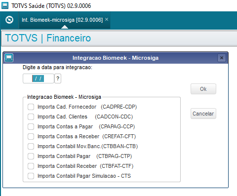
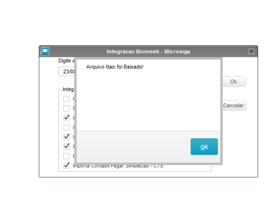
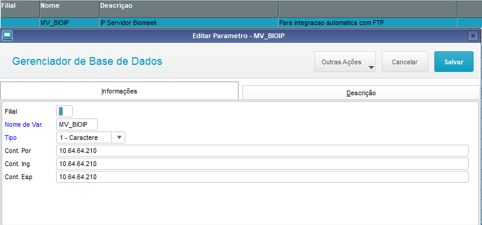
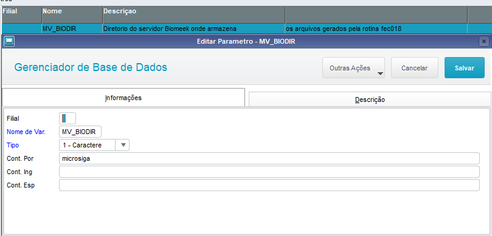

**INTEGRAÇÃO (BIOMEEK x PROTHEUS)**
---
**Integração Biomeek - Microsiga - FEC0018 - UNICTB**
---

Para que a integração dos dados do Biomeek ocorra no Protheus, é necessário que tenha realizado a geração dos arquivos no Biomeek, e que a montagem da pasta do FTP SRVORACVLE4(Máquina virtual que executa a aplicação do Biomeek) tenha ocorrido no servidor IW2-VM(Servidor que hospeada a máquina vitural onde a aplicação do Biomeek está sendo executada), assim será possível utilizar a rotina Int. Biomeek - Microsiga(Nome do fonte\rotina: UNICTB).

**Possiveis problemas:**

Caso ao tentar realizar a importação dos dados na rotina Int. Biomeek - Microsiga e o sistema tenha retornado a seguinte mensagen: "Arquivo não foi baixado", é porque não há arquivos no diretório FTP configurado nos parâmetros MV_BIOIP e MV_BIODIR, indicando a possibilidade de falha da montagem da pasta do FTP SRVORACVLE4(Máquina virtual que executa a aplicação do Biomeek) no servidor IW2-VM(Servidor que hospeada a máquina vitural onde a aplicação do Biomeek está sendo executada)

Para sanar tal falha, basta registrar um chamado para o SETRS solicitando a montagem da pasta do FTP SRVORACVLE4 no servidor IW2-VM.

**Parâmetros do Protheus:**

**- MV_BIOIP (IP do Servidor FTP):**

OBS: O IP informado na imagem acima refere-se ao servidor onde fica hospedado a máquina virtual do Biomeek, em casos de alteração da máquina virtual é necessário realizar a alteração do redirecionamento interno por meio do SETRS, caso ocorra a alteração do servidor que hospeda a máquina virtual do Biomeek, é necessário realizar a alteração do IP no parâmetro MV_BIOIP do Protheus.

**- MV_BIODIR (Nome do Diretório FTP):**

OBS: Em caso de alteração do nome do diretório no Biomeek, é necessário alterar o nome do diretório no parâmetro MV_BIODIR do Protheus. 

---

