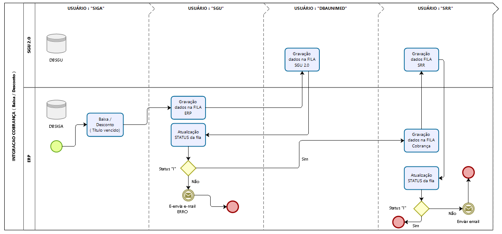
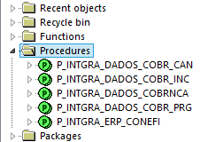
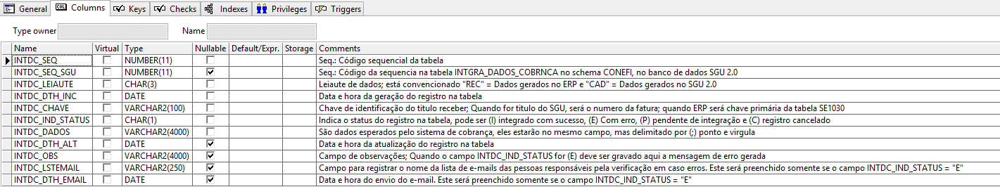
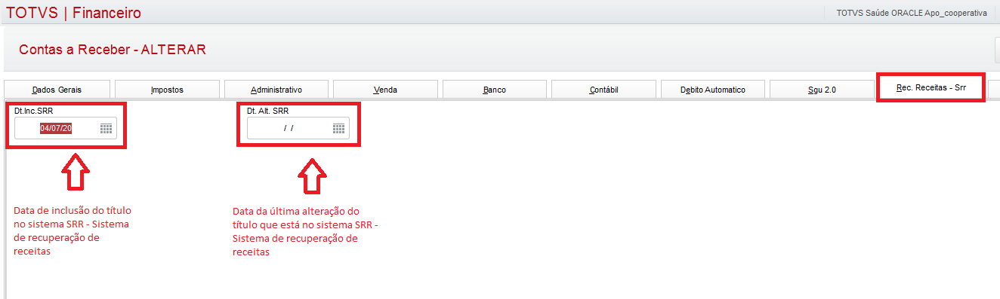

Nesta página contém informações sobre os processos de integração entre os sistemas ERP ( Protheus ) e CONEFI - Sistema de recuperação de receitas. Serão descritas apenas as funcionalidades técnicas de integração entre os dois sistemas.

O sistema de recuperação de receitas "CONEFI" foi construído pela empresa ITSS e disponibilizado os programas fontes para a equipe de desenvolvimento interno da TI possa fazer as manutenções e/ou implementações. Este sistema possui três módulos:

*  **COBRANÇA**    - Realiza processo de cobrança de títulos vencidos ( colocar aqui a URL com manual do sistema )

*  **NEGOCIAÇÃO**  - Realiza a negociação de títulos  ( colocar aqui a URL com manual do sistema )

*  **FIDELIZAÇÃO** - Realiza avaliação e contenção de clientes ( colocar aqui a URL com manual do sistema )


**COBRANÇA:** 
---
* [ ]  Fluxograma:



* [ ]  Infra-estrutura de comunicação entre os sistemas:

BANCO DE DADOS - ERP :

Foi criado o usuário "SRR" e concedidas permissões conforme script abaixo:

```
-- Create the user 
create user CONEFI
  default tablespace TS_DATA
  temporary tablespace TEMP
  profile DEFAULT;
-- Grant/Revoke object privileges 
grant execute on SGU.F_COD_FEDERACAO_UNI to CONEFI;
grant execute on SGU.F_COD_FEDERACAO_UNI_DESC to CONEFI;
grant select on SGU.V_CADAST_MSGS_ITEM to CONEFI;
grant select on SGU.V_EMIS_FATURA_REC_BASE to CONEFI;
grant select on SGU.V_FATURA_REC to CONEFI;
grant select on SGU.V_PARAM_VALOR to CONEFI;
grant select on SIGA.SA1030 to CONEFI;
grant select, update on SIGA.SE1030 to CONEFI;
grant select on SIGA.SE5030 to CONEFI;
grant select on SIGA.Z99030 to CONEFI;
-- Grant/Revoke role privileges 
grant connect to CONEFI;
grant dba to CONEFI;
grant resource to CONEFI;
-- Grant/Revoke system privileges 
grant create job to CONEFI;
grant create view to CONEFI;
grant select any dictionary to CONEFI;
grant unlimited tablespace to CONEFI;
```

BANCO DE DADOS - SGU 2.0 

Criado o usuário "CONEFI":

```
-- Create the user 
create user CONEFI
  default tablespace CONEFI_DATA
  temporary tablespace TEMP;
-- Grant/Revoke role privileges 
grant connect to CONEFI;
-- Grant/Revoke system privileges 
grant create any procedure to CONEFI;
grant create any trigger to CONEFI;
grant create database link to CONEFI;
grant create job to CONEFI;
grant create sequence to CONEFI;
grant create session to CONEFI;
grant create synonym to CONEFI;
grant create table to CONEFI;
grant create view to CONEFI;
grant unlimited tablespace to CONEFI;

```

Foram criadas as seguintes stored procedure no usuário "CONEFI" no banco de dados ERP:



* [ ]  Leiautes de troca de informações:



Na coluna "INTDC_DADOS", o primeiro dado é a ação a ser executada pelo sistema CONEFI :

------------------------------------------------------------------------------------------------------------------------
Definição das rubricas de ações:   03/07/2020
------------------------------------------------------------------------------------------------------------------------
"INC" - Inclusão do título no sistema de CONEFI ( ERP vai enviar os dados do título, assim que o titulo ficar vencido )
        Será enviada uma vez ao dia, as 5h da manhã. Por JOB
        
"PGO" - Pagamento do título, pode ser total ou parcial   ( depende do evento no ERP, será disparado por trigger na tabela SGU.INTGRA_RET_ERP )

"DES" - Quando houve alguma alteração no valor do título ( depende do evneto no ERP, será disparada por trigger na tabela SGU.INTGRA_RET_ERP )

"PRG" - Quando houve prorrogação na data de vencimento do título.

"CAN" - Quando ocorrer cancelamento do título, será por JOB. executado 5h da manhã.


"HST" - Envia o histórico dos últimos 12 meses, está ação é gerada quando a ação antecedente for "INC","DES" e "PRG".  
	    será gerada uma linha para cada título. por JOB. executado 5h da manhã.

EST - Estorno de Qualquer movimentação do título, conforme as situações previstas acima. Deverá ser enviado o registro identificador do lançamento de origem:.

"PRV" - Quando houve vencimento de um título anteriormente prorrogado.


Campos CUSTOMIZADOS no ERP ( TABELA: SE1030 ):




**NEGOCIAÇÃO:** 
---

**FIDELIZAÇÃO:** 
---
