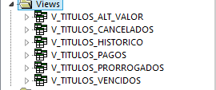
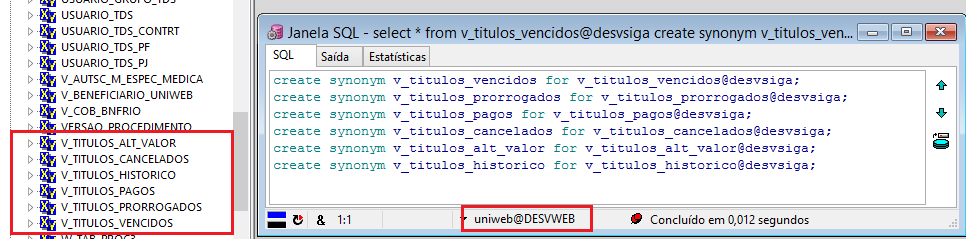

Nesta página vamos descrever as ações realizadas nos bancos de dados do ERP ( Protheus ), SGU e WEB para que seja possível gerar os dados conforme requisitos a ser utilizado pelo usuário UNIWEB no banco de dados WEBRAC ( site ).

A ti/sistemas desenvolveu as APIs para serem consumidas por WebServices, o usuário/schema de banco de dados utilizado para obter/executar as consultas é o UNIWEB no banco de dados WEBRAC.  

Este usuário UNIWEB para ter acesso ao banco de dados do ERP, foi criado um dblink entre os bancos DBSIGA e WEBRAC. O nome desse databaselink é "@webrac" e tem os seguintes usuários; no banco de dados do ERP (DBSIGA) tem o usuário "UNIWEB", no outro banco de dados o usuário UNIWEB.


Databaselink
---
`@dbweb` ( Ambiente de produção ) - Este dblink deve ser criado no banco de dados do ERP ( DBSIGA) e o usuário a ser usado nele é o "uniweb", no outro banco de dados (WEBRAC) será utilizado o usuário "uniweb". 

`@desvweb` ( Ambiente de homologação/testes ) - Este dblink deve ser criado no banco de dados do ERP ( DESVSIGA) e o usuário a ser usado nele é o "uniweb", no outro banco de dados (DESVWEB) será utilizado o usuário "uniweb". 

Usuário UNIWEB 
---

Seguindo as recomendações das melhores práticas de segurança, não devemos utilizar o usuário do sistema na criação do databaselink, no caso do sistema ERP o usuário é o "SIGA". 

Então, criamos o usuário UNIWEB nos bancos (DBSIGA, produção e DESVSIGA, homologação ) e foram concedidas permissões de consulta ( select ) apenas nas tabelas necessárias para serem utilizada nas APIs.

Abaixo os scripts utilizados na criação do usuário:
````
-- Drop user
drop user UNIWEB;
-- Create the user 
create user UNIWEB
  identified by unimed
  default tablespace USERS
  temporary tablespace TEMP
  profile DEFAULT;
-- Grant/Revoke object privileges 
grant execute on SYS.UTL_MAIL to UNIWEB;
grant execute on SYS.UTL_SMTP to UNIWEB;
-- Grant/Revoke role privileges 
grant connect to UNIWEB;
grant resource to UNIWEB;
-- Grant/Revoke system privileges 
grant create session to UNIWEB;
grant create synonym to UNIWEB;
grant create view to UNIWEB;
grant unlimited tablespace to UNIWEB;
---
grant select on siga.sa1030 to uniweb;
grant select on siga.se1030 to uniweb;
grant select on siga.se5030 to uniweb;
````

Permissões concedidas:
---

Como foi comentado anteriormente o dono das tabelas que serão utilizadas nas APIs pertence ao usuário SIGA, e o usuário que fará as execuções das querys é "Uniweb". Logo, para que seja possível realizar as consultas, foram concedidas as seguintes permissões:

1 - **Com o usuário "SIGA"** ( No banco de dados do ERP );
```
grant select on siga.sa1030 to uniweb;  --> tabela com dados dos clientes
grant select on siga.se1030 to uniweb;  --> tabela com dados das faturas
grant select on siga.se5030 to uniweb;  --> tabela com dados financeiros ( baixas, descontos, multas, etc...)
```

2 - **Com o usuário "SGU"** ( No banco de dados do ERP );
```
tabela: **fatura_rec**
create synonym fatura_recfor dbaunimed.fatura_rec@desvsgu;
create or replace view v_fatura_rec as select * from fatura_rec;
grant select on v_fatura_rec to uniweb;

tabela: **cadast_msgs_item**
create synonym cadast_msgs_item for dbaunimed.cadast_msgs_item@desvsgu;
create or replace view v_cadast_msgs_item as select * from   cadast_msgs_item;
grant select on v_cadast_msgs_item to uniweb;

tabela: **param_valor**
create synonym param_valorfor dbaunimed.param_valor@desvsgu;
create or replace view v_param_valor as select * from   param_valor
grant select on v_param_valor to uniweb;

tabela: **emis_fatura_rec_base**
grant select on emis_fatura_rec_base to siga; ( permissão concedida pelo usuário dbaunimed no banco do SGU )
create synonym emis_fatura_rec_base for dbaunimed.emis_fatura_rec_base@desvsgu;
create or replace view v_emis_fatura_rec_base as select * from emis_fatura_rec_base;
grant select on v_emis_fatura_rec_base to uniweb;


Obs. O usuário "SGU" no banco de dados do ERP, é o usuário utilizado no dblink entre o ERP e sistema SGU. E para que o usuário UNIWEB possa realizar consultas no SGU é necessária a criação do sinonimo, view e por ultimo conceder permissão de select, no caso deve estar conectar com o usuário SGU para realizar essas ações.

```

3 - Com o usuário UNIWEB ( No banco de dados do ERP )
---

Foram criadas visões para simplificar as consultas a serem realizadas pela API.

3.1 - **Consulta títulos vencidos** ( view : v_titulos_vencidos  )

3.2 - **Consulta títulos prorrogados** ( view : v_titulos_prorrogados  )

3.3 - **Consulta títulos pagos** ( view : v_titulos_pagos  )

3.4 - **Consulta títulos cancelados** ( view : v_titulos_cancelados  )

3.5 - **Consulta títulos alteração de valor** ( view : v_titulos_alt_valor  )

3.6 - **Consulta títulos historico 12 meses** ( view : v_titulos_historico  )



4 - Com o usuário UNIWEB ( No banco de dados DESVWEB )
---
4.1 - **Consulta títulos vencidos** ( view : v_titulos_vencidos  )

4.2 - **Consulta títulos prorrogados** ( view : v_titulos_prorrogados  )

4.3 - **Consulta títulos pagos** ( view : v_titulos_pagos  )

4.4 - **Consulta títulos cancelados** ( view : v_titulos_cancelados  )

4.5 - **Consulta títulos alteração de valor** ( view : v_titulos_alt_valor  )

4.6 - **Consulta títulos historico 12 meses** ( view : v_titulos_historico  )



5 - Parametros de entrada/saida nas views
---
Acessar projeto de cobrança [aqui](https://labs.unimedgoiania.coop.br/ti/setsis/desenvolvimento/itss/processo-cobranca/-/wikis/guia-desenvolvedores#formato-da-requisi%C3%A7%C3%A3o-da-api-financeiro)