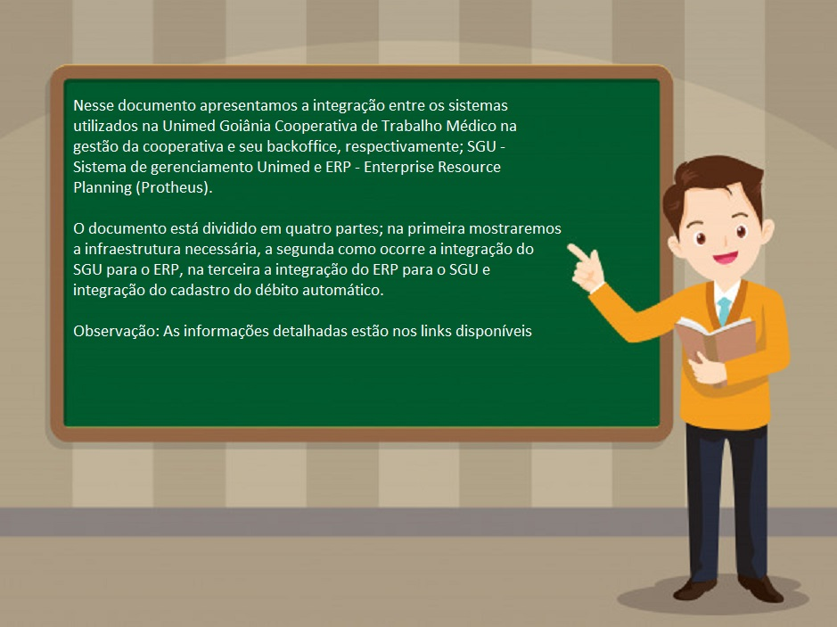
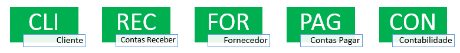

**INTEGRAÇÃO ( SGU 2.0 x ERP ) e ( ERP x SGU 2.0 )**
---
---
**APRESENTAÇÃO**
---

---
**01 - INFRAESTRUTURA**
---

Os sistemas SGU e ERP da empresa TOTVS possuem várias opções de integração; WebService, Database link ou Arquivo texto. 

A Unimed Goiânia optou por Database link porque os bancos de dados utilizados por esses sistemas, ambos utilizam o SGBD (Sistema gerenciados de banco de dados) da Oracle.

O sistema SGU possui uma coleção de objetos prontos no seu banco de dados para exportação de dados nativamente, nesse ponto não houve solicitações de customizações por parte da Unimed Goiânia.  

Toda ação realizada no SGU 2.0 que envolve a integração, há objetos no banco de dados que faz a criação um registro na tabela "INTGRA_SGU_ERP" e "INTGRA_SGU_ERP_ITEM" ambas no usuário/schema "DBAUNIMED". O registro fica com status de pendente à espera da leitura por parte do ERP.

No sistema ERP foi customizada uma coleção de objetos no seu banco de dados para fazer a leitura dos dados exportados pelo SGU e realizar as operações necessárias nos módulos que vão ser utilizados, a principio serão utilizados os módulos; Financeiro, Faturamento e Contabilidade Gerencial.

Os objetos de banco de dados utilizados na solução, está distribuído em:

*  [Objetos no banco de dados SGU (Usuário, Tabelas e Jobs)](https://labs.unimedgoiania.coop.br/ti/setsis/desenvolvimento/protheus/protheus-unimed/wikis/ObjetosBancoDadosSGU)
*  [Objetos no banco de dados ERP (Usuário, Tabelas e Jobs)](https://labs.unimedgoiania.coop.br/ti/setsis/desenvolvimento/protheus/protheus-unimed/wikis/ObjetosBancoDadosERP)

Configurações auxiliares:

*  [Parâmetros da integração ( Tabela SIGA.Z99030 )](https://labs.unimedgoiania.coop.br/ti/setsis/desenvolvimento/protheus/protheus-unimed/wikis/ParametrosDaIntegracao?)
*  [Parâmetros do sistema    ( Módulo configurador )](https://labs.unimedgoiania.coop.br/ti/setsis/desenvolvimento/protheus/protheus-unimed/wikis/ParametrosDeSistema?)

*  [Compilação das rotinas por RPO](https://labs.unimedgoiania.coop.br/ti/setsis/desenvolvimento/protheus/protheus-unimed/wikis/RotinaRPO?)

*  [Manual integração FESC - Confluence](https://confluence.fesctecnologia.com.br/pages/viewpage.action?pageId=50504624)
---
**02 - INTEGRAÇÃO SGU x ERP**
---

**Leiautes da integração:**

A integração do sistema de gestão unimed (SGU) para o ERP ocorre por meio de leiautes pré-definidos pelos responsáveis do sistema.  Os leiautes utilizados são:

**"[CLI](https://labs.unimedgoiania.coop.br/ti/setsis/desenvolvimento/protheus/protheus-unimed/wikis/LeiauteCLI)"** - São dados relativos ao **cadastro do cliente**, esses dados são lidos na tabela de integração no banco de dados do SGU 2.0, as tabelas são: "INTGRA_SGU_ERP" e "INTGRA_SGU_ERP_ITEM", ambas estão no usuário/schema do banco "DBAUNIMED". A leitura considera somente registros que estão com status "P" (pendente) para incluir ou alterar dados na tabela de clientes do ERP (SA1). Mais informações click [aqui](https://labs.unimedgoiania.coop.br/ti/setsis/desenvolvimento/protheus/protheus-unimed/wikis/LeiauteCLI)

[**"REC"**](https://labs.unimedgoiania.coop.br/ti/setsis/desenvolvimento/protheus/protheus-unimed/wikis/LeiauteREC) - São dados relativos às **faturas geradas**,  esses dados são lidos na tabela de integração no banco de dados do SGU 2.0, as tabelas são: "INTGRA_SGU_ERP" e "INTGRA_SGU_ERP_ITEM", ambas estão no usuário/schema do banco "DBAUNIMED". A leitura considera somente registros que estão com status "P" (pendente) para inserir ou atualizar dados na tabela do contas receber no ERP (SE1). Mais informações click [aqui](https://labs.unimedgoiania.coop.br/ti/setsis/desenvolvimento/protheus/protheus-unimed/wikis/LeiauteREC)

Obs. os registros são criados nas tabelas de integração após a geração da capa da fatura no SGU 2.0

[**"FOR"**](https://labs.unimedgoiania.coop.br/ti/setsis/desenvolvimento/protheus/protheus-unimed/wikis/LeiauteFOR) - São dados relativos ao **cadastro de fornecedores**, podem ser; Médicos, Clínicas, Laboratórios, Hospitais, Unimed, Clientes que serão reembolsados e/ou restituídos. Esses dados são lidos na tabela de integração no banco de dados do SGU 2.0, as tabelas são: "INTGRA_SGU_ERP" e "INTGRA_SGU_ERP_ITEM", ambas estão no usuário/schema do banco "DBAUNIMED". A leitura considera somente registros que estão com status "P" (pendente) para incluir ou alterar o cadastro de fornecedores do ERP (SA2). Mais informações click [aqui](https://labs.unimedgoiania.coop.br/ti/setsis/desenvolvimento/protheus/protheus-unimed/wikis/LeiauteFOR)

[**"PAG"**](https://labs.unimedgoiania.coop.br/ti/setsis/desenvolvimento/protheus/protheus-unimed/wikis/LeiautePAG) - São dados relativos aos **pagamentos de valores gerado no SGU**, podem ser; Médicos, Clinica, Laboratórios, Hospitais, Unimed, Clientes que serão reembolsados e/ou restituido. Esses dados são lidos na tabela de integração no banco de dados do SGU 2.0, as tabelas são: "INTGRA_SGU_ERP" e "INTGRA_SGU_ERP_ITEM", ambas estão no usuário/schema do banco "DBAUNIMED". A leitura considera somente registros que estão com status "P" (pendente) para incluir ou alterar dados na tabela do contas pagar no ERP (SE2). Mais informações click [aqui](https://labs.unimedgoiania.coop.br/ti/setsis/desenvolvimento/protheus/protheus-unimed/wikis/LeiautePAG)

[**"CON"**](https://labs.unimedgoiania.coop.br/ti/setsis/desenvolvimento/protheus/protheus-unimed/wikis/LeiauteCON) - São dados relativos a geração de faturas, valores a serem pagos no SGU 2.0. Através da geração de lotes contábeis, são criados lançamentos referente aos valores, eles são chamados de provisão contábil.  Posteriormente quando o setor financeiro realizar o recebimento das faturas e pagamento aos fornecedores, essas provisões são baixadas. A baixa da provisão não é feito via integração, são lançamentos padrões que foram configurados no ERP para quando tiver a ação de liquidação de fatura e/ou pagamento o proprio modulo financeiro gera os lançamentos das baixas das provisões. Mais informações click [aqui](https://labs.unimedgoiania.coop.br/ti/setsis/desenvolvimento/protheus/protheus-unimed/wikis/LeiauteCON)

Esses dados são lidos na tabela de integração no banco de dados do SGU 2.0, as tabelas são: "INTGRA_SGU_ERP" e "INTGRA_SGU_ERP_ITEM", ambas estão no usuário/schema do banco "DBAUNIMED". A leitura considera somente registros que estão com status "P" (pendente).

Obs.: Para mais detalhes de cada módulo, utilize o link de cada leiaute

[**RESUMO INTEGRACAO - Confluence (FESC)**](https://confluence.fesctecnologia.com.br/pages/viewpage.action?pageId=56924241)

---
**03 - INTEGRAÇÃO ERP x SGU**
---

**Leiautes da integração:**

A integração do ERP para o SGU 2.0 ocorre quando há alguma liquidação, baixa e/ou desconto em fatura que teve origem no SGU, ou quando ocorre o pagamento de algum valor que teve origem no SGU. Estas ações realizadas sobre fatura a receber e/ou titulo à pagar ocorrerão com mais frequência, há também a integração dos cadastros no débito automático quando o banco envia o pedido via arquivo e quando há alterações no plano de contas contábil no ERP.

Para que a integração ocorra, foram criados vários objetos no banco de dados do ERP. A Unimed Goiânia optou por desenvolver uma solução que mantenha o sistema ERP funcionando independente se o SGU estiver parado. Para isso há uma fila de dados no ERP, para quando o sistema SGU for restabelecido os dados são enviados na ordem que chegaram à fila.

A solução desenvolvida concentra os objetos de banco de dados num usuário/schema no banco de dados do ERP.  O usuário/schema chama-se "SGU", nele foi criada a tabela "INTGRA_ERP_SGU" (fila), os campos são similares aos da tabela de integração do SGU, com alguns campos à mais para controlar o envio de dados para o SGU e identificar o usuário do sistema, rotina utilizada e ponto de entrada disponível pelo fornecedor de ERP.

Os módulos do ERP que tiveram customizações para enviar dados para o SGU 2.0 foram:

**Módulo Financeiro**

* [ Contas à receber ](https://labs.unimedgoiania.coop.br/ti/setsis/desenvolvimento/protheus/protheus-unimed/wikis/ERPxSGUCtasRec)

* [ Contas à pagar ](https://labs.unimedgoiania.coop.br/ti/setsis/desenvolvimento/protheus/protheus-unimed/wikis/ERPxSGUCtasPag)

**Módulo Contabilidade**

* [ Plano de contas ](https://labs.unimedgoiania.coop.br/ti/setsis/desenvolvimento/protheus/protheus-unimed/wikis/ERPxSGUPlnCtas)

**Notificações de falhas**

* [ E-mail ERRO integração ](https://labs.unimedgoiania.coop.br/ti/setsis/desenvolvimento/protheus/protheus-unimed/wikis/EmailErroIntgra)

Obs.: Para mais detalhes de cada módulo, utilize o link nos módulos

---
**04 - DÉBITO AUTOMÁTICO**
---

No sistema SGU foram utilizadas as mesmas regras do sistema Biomeek, onde é permitido somente o cadastro de clientes de contratos pessoa física ou clientes que tenha origem em contratos pessoa jurídica que estão na condição de  "aposentado ou demitido" ( inativo ).

Os cadastros serão permitidos quando a fatura for emitida contra um cliente pessoa física (Titular). Os clientes "aposentado ou demitido" possuem plano de pessoa jurídica mas a fatura é emitida contra o titular, igual aos contratos de clientes pessoa física.

As faturas são impressas a partir de dados no SGU e este define quem possui ou é um candidato a ter o débito automático. O cliente com o código de identificação impresso na fatura deve fazer a solicitação ao banco conveniado.

Após a solicitação do cliente junto ao banco, este gera e disponibiliza em seus meios de comunicação, arquivos no leiaute FEBRABAN150. O qual o setor financeiro faz o donwload e processa as baixas e/ou ocorrências referente ao débito automático.

Abaixo está o passo à passo da solução desenvolvida:

[ 01 -  Cadastro do titular no SGU 2.0 ](https://labs.unimedgoiania.coop.br/ti/setsis/desenvolvimento/protheus/protheus-unimed/wikis/DEBAUTCadSGU)

[ 02 - Disponibilidade dos dados para ERP ](https://labs.unimedgoiania.coop.br/ti/setsis/desenvolvimento/protheus/protheus-unimed/wikis/DEBAUTDispERP)

[ 03 - Cadastro débito automático no ERP ](https://labs.unimedgoiania.coop.br/ti/setsis/desenvolvimento/protheus/protheus-unimed/wikis/DEBAUTCadERP)

[ 04 - Agendamento de faturas nos bancos pelo ERP ](https://labs.unimedgoiania.coop.br/ti/setsis/desenvolvimento/protheus/protheus-unimed/wikis/DEBAUTAgndFat)

[ 05 - Processar arquivos de retorno bancário no ERP ](https://labs.unimedgoiania.coop.br/ti/setsis/desenvolvimento/protheus/protheus-unimed/wikis/DEBAUTArqRET)
