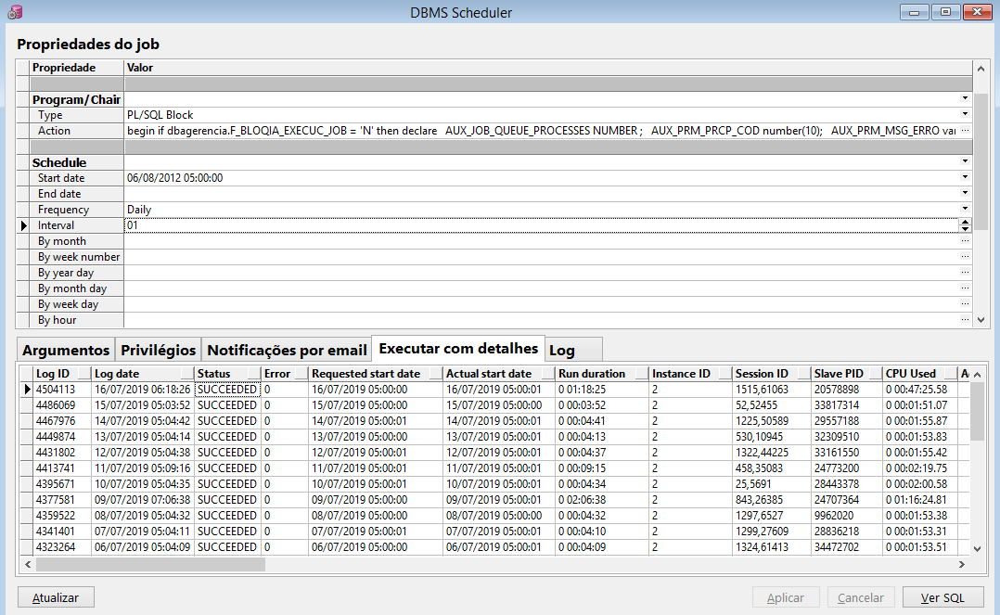
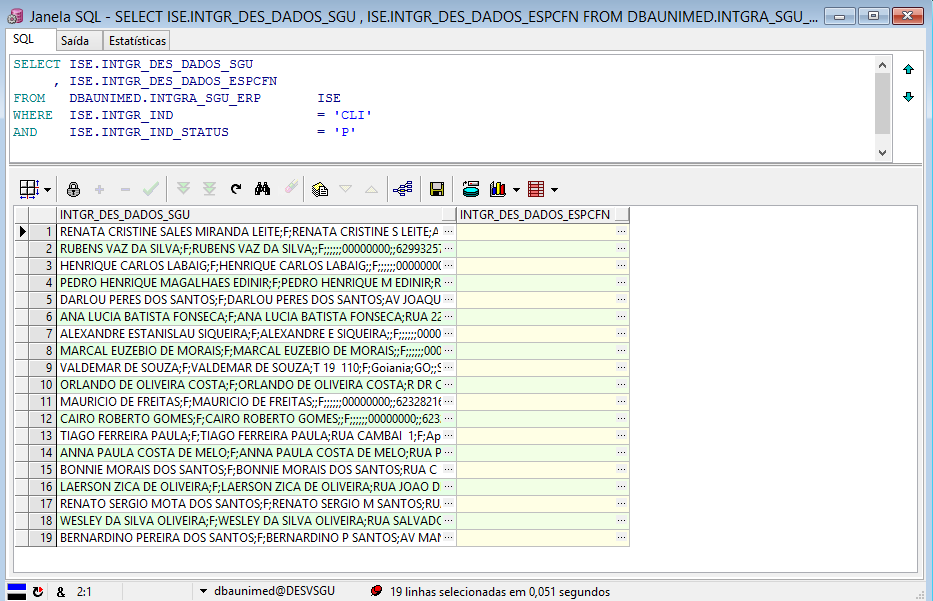
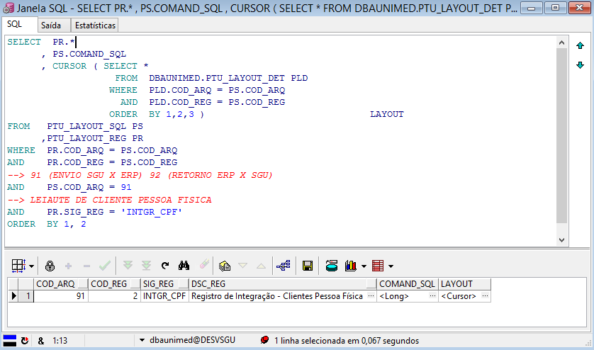
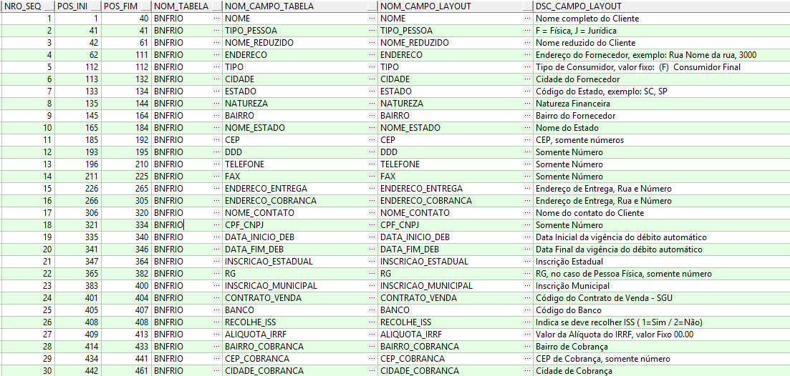
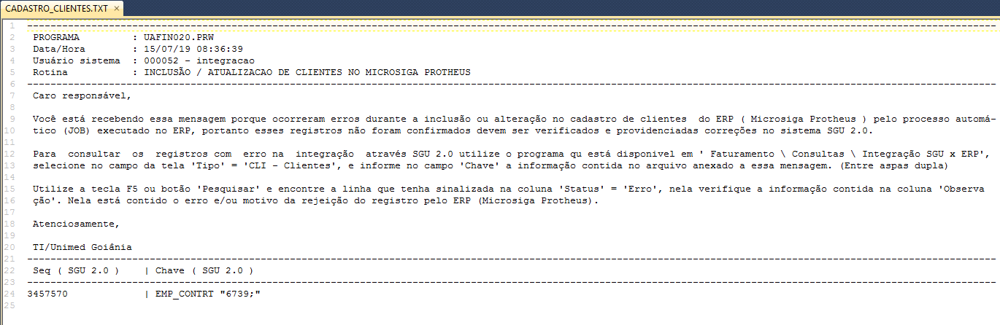

**LEIAUTE "CLI"**

Nesse documento vamos descrever a sequencia das execuções das tarefas para que ocorra a integração do SGU 2.0 para o ERP ( Protheus ). 

Nesse leiaute são enviados os dados dos clientes para serem integrados com o ERP. São clientes do tipo pessoa física, jurídica e intercâmbio ( Outra Unimed ). Sempre que ocorrer alguma alteração nos dados deles no SGU 2.0,  são atualizados no ERP de forma automática.

**01 - JOB** - J_P_GERA_INTGRA_CLIENT deve estar ativo/habilitado no banco de dados do sistema SGU 2.0 para que os dados sejam enviados para tabela de integração.

Durante o processo de validação no ambiente de homologação este job foi ativado para ser executado uma vez ao dia, às 05h00 da manhã, mas quando tiver habilitado em produção pode ser que tenha outra periodicidade.



**02 - PROCEDURE** 

Esse job executa a procedure "**P_GERA_INTGRA_CLIENT**" que pertence ao fornecedor pelo sistema SGU 2.0 (FESC). Portanto qualquer modificação nela deve ser pelo fornecedor do sistema SGU, A execução dessa procedure cria registros na tabela de integração no SGU **DBAUNIMED.INTGRA_SGU_ERP** com o status de "P" = Pendente no campo INTGR_IND_STATUS. Situação da qual o ERP vai identificar que há registros para serem integrados.

**03 - TABELA DE INTEGRACAO**

``````
SELECT *
FROM   DBAUNIMED.INTGRA_SGU_ERP       ISE
WHERE  ISE.INTGR_IND                  = 'CLI'
AND    ISE.INTGR_IND_STATUS           = 'P'

``````
Dados utilizados na integração são obtidos a partir dos campos **INTGR_DES_DADOS_SGU** e/ou **INTGR_DES_DADOS_ESPCFN** (Obs. O campo INTGR_DES_DADOS_ESPCFN vem preenchido somente quando há customizações feitas na FESC).



**04 - LEIAUTE DO CAMPO "INTGR_DES_DADOS_SGU"**

O fornecedor do sistema SGU 2.0 (FESC) disponibilizou um arquivo PDF com o leiaute e pode ser consultado no link abaixo.

[20180101_Integração_do_SGU_x_ERP.pdf](uploads/24bde8c30878af8aee7ae2507abb700c/20180101_Integração_do_SGU_x_ERP.pdf)

Na consulta ao manual em PDF pode ser que esteja desatualizado temporariamente em decorrência da atualizações de pacotes no SGU 2.0 e o tempo para que o fornecedor do sistema disponibilize o novo manual.  Para contornar essa possível situação, pode ser executado os scripts abaixo, através deles é possível obter o leiaute atualizado.

**04.1 - Leiaute cliente PESSOA FÍSICA**

``````
SELECT  PR.*
      , PS.COMAND_SQL
      , CURSOR ( SELECT *
                   FROM  DBAUNIMED.PTU_LAYOUT_DET PLD
                  WHERE  PLD.COD_ARQ = PS.COD_ARQ
                    AND  PLD.COD_REG = PS.COD_REG
                  ORDER  BY 1,2,3 )                             LAYOUT
FROM   DBAUNIMED.PTU_LAYOUT_SQL PS
      ,DBAUNIMED.PTU_LAYOUT_REG PR     
WHERE  PR.COD_ARQ = PS.COD_ARQ
AND    PR.COD_REG = PS.COD_REG
--> 91 (ENVIO SGU X ERP) 92 (RETORNO ERP X SGU)
AND    PS.COD_ARQ = 91  
--> LEIAUTE DE CLIENTE PESSOA FISICA
AND    PR.SIG_REG = 'INTGR_CPF'
ORDER  BY 1, 2
``````


| CAMPO| Objetivo |
| ------ | ------ |
| COD_ARQ | 91 - Código leiaute interno para dados exportados do SGU 2.0 para ERP |
| SIG_REG| INTGR_CPF - Sigla do cadastro interno do leiaute PF|
| DSC_REG| Descritivo do cadastro interno do leiaute|
| COMAND_SQL| Comando DML utilizado para gerar os registros na tabela de integração|
| LAYOUT| Estrutura de dados do leiaute interno |

**Dados do "LAYOUT"** - Os campos são separados por ponto e virgula (";")



**04.2 - Leiaute cliente PESSOA JURÍDICA**

``````
SELECT  PR.*
      , PS.COMAND_SQL
      , CURSOR ( SELECT *
                   FROM  DBAUNIMED.PTU_LAYOUT_DET PLD
                  WHERE  PLD.COD_ARQ = PS.COD_ARQ
                    AND  PLD.COD_REG = PS.COD_REG
                  ORDER  BY 1,2,3 )                             LAYOUT
FROM   PTU_LAYOUT_SQL PS
      ,PTU_LAYOUT_REG PR     
WHERE  PR.COD_ARQ = PS.COD_ARQ
AND    PR.COD_REG = PS.COD_REG
--> 91 (ENVIO SGU X ERP) 92 (RETORNO ERP X SGU)
AND    PS.COD_ARQ = 91  
--> LEIAUTE DE CLIENTE PESSOA JURÍDICA
AND    PR.SIG_REG = 'INTGR_CNPJ'
ORDER  BY 1, 2
``````
As demais informações sobre o leiaute é igual ao leiaute de PF

**04.3 - Leiaute cliente UNIMED**

``````
SELECT  PR.*
      , PS.COMAND_SQL
      , CURSOR ( SELECT *
                   FROM  DBAUNIMED.PTU_LAYOUT_DET PLD
                  WHERE  PLD.COD_ARQ = PS.COD_ARQ
                    AND  PLD.COD_REG = PS.COD_REG
                  ORDER  BY 1,2,3 )                             LAYOUT
FROM   PTU_LAYOUT_SQL PS
      ,PTU_LAYOUT_REG PR     
WHERE  PR.COD_ARQ = PS.COD_ARQ
AND    PR.COD_REG = PS.COD_REG
--> 91 (ENVIO SGU X ERP) 92 (RETORNO ERP X SGU)
AND    PS.COD_ARQ = 91  
--> LEIAUTE DE CLIENTE UNIMED
AND    PR.SIG_REG = 'INTGR_UD'
ORDER  BY 1, 2
``````
As demais informações sobre o leiaute é igual ao leiaute de PF

**05 - Importação dos dados no ERP**
---

Foi criada a rotina UAFIN020.PRW no Protheus para que ela leia os dados na tabela de integração do SGU 2.0 (DBAUNIMED.INTGRA_SGU_ERP), fazer validações e escrever os dados na tabela de CLIENTES (SA1030) do ERP. Caso encontrei não conformidades nos dados durante a validação dados, o registro não é importado e informado na tabela de integração o motivo da não integração.

Essa rotina é executada através de JOB (APO_WSJOB) no Protheus, sendo feita a chamada pelo gerenciador de JOBs no Protheus na rotina UNI_JOB.PRW ou manualmente através de outra rotina UAFIN019 a qual está disponível no menu de usuário e ela faz a chamada da UAFIN020.

Para visualizar o código fonte das rotinas criadas, acesso os links abaixo:

[UNI_JOB.PRW  - Gerenciador de JOBs no Protheus](https://labs.unimedgoiania.coop.br/ti/setsis/desenvolvimento/protheus/protheus-unimed/blob/master/ProjetoHOMOLOGA/ProjetoSGU%202.0/JOBs/UNIJOB.prw)

[UAFIN019.PRW - Gerenciador de rotinas da integração para execuções manuais](https://labs.unimedgoiania.coop.br/ti/setsis/desenvolvimento/protheus/protheus-unimed/blob/master/ProjetoHOMOLOGA/ProjetoSGU%202.0/Financeiro/Aplica%C3%A7%C3%B5es/UAFIN019.PRW)

[UAFIN020.PRW - Importação de dados no leiaute do SGU 2.0 dos clientes para SA1 via MsExecAuto.](https://labs.unimedgoiania.coop.br/ti/setsis/desenvolvimento/protheus/protheus-unimed/blob/master/ProjetoHOMOLOGA/ProjetoSGU%202.0/Financeiro/Aplica%C3%A7%C3%B5es/UAFIN020.PRW)

**05.1 - Validações dos dados pela rotina UAFIN020**

A rotina acessa a tabela de integrações (DBAUNIMED.INTGRA_SGU_ERP) do SGU 2.0 e verifica se há registros com status "P" (campo "INTGR_IND_STATUS" = "P", indica pendente de integração), se encontrar é feita a validação dados dados. Se os dados lidos estiveram em conformidade com as regras de validação o registro é inserido ou alterado no cadastro de clientes do Protheus (SA1). Caso encontre alguma não conformidade o registro não é importado, e o status é alterado para "E" (erro), na coluna de observação ("INTGR_DES_OBS") da tabela de integração é gravado o motivo do erro.

Na sequencia essa rotina envia e-mail para os endereços que estão previamente cadastrados no parâmetro "LS_ENDERECO_EMAIL_RESPONSAVEIS_INTEGRACAO_CLIENT" da tabela de parâmetros de integração (Z99030). Esse e-mail contém um arquivo texto anexo com instruções sobre como consultar o motivo de erro no SGU 2.0, bem como o código "CHAVE" para realizar a consulta.

Exemplo de um registro rejeitado 




**06 - Scripts uteis para TI/SUPORTE**
---

Nesta seção contém alguns scripts uteis para serem utilizados pelo equipe de TI/Suporte

**CLIENTE PESSOA FISICA**

```
declare
-----------------------------------------------------------------------------------------------------------------------------------------------
-- Data : 04/12/2020  Autor : Roberto Mar Pereira     Objetivo: Fazer o envio dos dados da pessoa responsavel pelo contrato para integração ERP
-----------------------------------------------------------------------------------------------------------------------------------------------
--  ORIENTAÇÕES :
--
--   1. Para executar esse script, o usuário do banco de dados deve ter privilégio de "INSERT" na tabela "DBAUNIMED.HIS_AUDIT_TAB_INTGRA"
--
--   2. Após a execução, o usuário deverá aguardar a execução do JOB de integrçaão de clientes. Esse script não envia os dados direto pra fila.
--
--   3. O código da pessoa informada no parametro, não necessáriamente deve ser do beneficiário titular. Porque este pode ter um pagador, nesse
--      caso deve ser utilizado o código da pessoa "Responsavel financeiro", "Responsavel" ou "Titular".
-----------------------------------------------------------------------------------------------------------------------------------------------

w_codigo_pessoa       number(20) := 0;

begin
  w_codigo_pessoa := &CodigoPessoa;  
  if w_codigo_pessoa > 0 and w_codigo_pessoa is not null then
    begin
      insert into DBAUNIMED.HIS_AUDIT_TAB_INTGRA
        SELECT SYSDATE                                                        hatbi_dth_atu
            ,  'BNFRIO'                                                       hatbi_nom_fisico_tab
            ,  b.cv_nro        ||';'||
               b.bnf_cod_pessoa||';'||
               to_char(b.bnf_dat_inic_vigen,'yyyy-mm-dd hh24:mi:ss')|| ';'    hatbi_val_chave
            ,  'A'                                                            hatbi_ind_tipo_audit
            ,  'INTGR_CLI'                                                    hatbi_ind_prcsso
            ,  'PESSOA'                                                       hatbi_nom_fisico_tab_orig
            ,  to_Date('01/01/0001', 'dd/mm/yyyy')                            hatbi_dth_atu_erp
            ,  NULL                                                           prcp_cod
            ,  NULL                                                           hatbi_qtde_erro
            ,  NULL                                                           hatbi_msg_erro
            ,  b.bnf_cod_pessoa || ';'                                        hatbi_val_chave_orig
          FROM DBAUNIMED.BNFRIO  b
         where b.bnf_dat_excl = '01/01/0001'
and   nvl(nvl(b.bnf_cod_pessoa_financ,
                       b.bnf_cod_pessoa_respon),
                       b.bnf_cod_pessoa)                                      in ( w_codigo_pessoa );
    exception 
      when others then
        raise_application_error(-20005,' Erro na inserção dos dados  : ' ||w_codigo_pessoa ||sqlerrm);      
    end;          
    commit; 
  end if;
end;                     

```

**CLIENTE PESSOA JURIDICA**

```
declare
-----------------------------------------------------------------------------------------------------------------------------------------------
-- Data : 04/12/2020  Autor : Roberto Mar Pereira     Objetivo: Fazer o envio dos dados da pessoa responsavel pelo contrato para integração ERP
-----------------------------------------------------------------------------------------------------------------------------------------------
--  ORIENTAÇÕES :
--
--   1. Para executar esse script, o usuário do banco de dados deve ter privilégio de "INSERT" na tabela "DBAUNIMED.HIS_AUDIT_TAB_INTGRA"
--
--   2. Após a execução, o usuário deverá aguardar a execução do JOB de integrçaão de clientes. Esse script não envia os dados direto pra fila.
--
-----------------------------------------------------------------------------------------------------------------------------------------------

w_codigo_empresa     number(20) := 0;

begin
  w_codigo_empresa := &CodigoEmpresa;  
  if w_codigo_empresa > 0 and w_codigo_empresa is not null then
    begin
      insert into DBAUNIMED.HIS_AUDIT_TAB_INTGRA
        SELECT SYSDATE                                                        hatbi_dth_atu
            ,  'EMP_CONTRT'                                                   hatbi_nom_fisico_tab
            ,  eca.empcn_cod || ';'                                           hatbi_val_chave
            ,  'A'                                                            hatbi_ind_tipo_audit
            ,  'INTGR_CLI'                                                    hatbi_ind_prcsso
            ,  'PESSOA_END_CONTAT'                                            hatbi_nom_fisico_tab_orig
            ,  to_Date('01/01/0001', 'dd/mm/yyyy')                            hatbi_dth_atu_erp
            ,  NULL                                                           prcp_cod
            ,  NULL                                                           hatbi_qtde_erro
            ,  NULL                                                           hatbi_msg_erro
            ,  pec.ass_cod ||';' ||pec.pes_cod ||';'|| pec.end_ind|| ';'      hatbi_val_chave_orig
      from   emp_contrt_agrmto                  eca
           , pessoa_end_contat                  pec
      where  eca.empca_cod_pessoa               = pec.pes_cod
      and    eca.empcn_cod                      = w_codigo_empresa;

    exception 
      when others then
        raise_application_error(-20005,' Erro na inserção dos dados  : ' ||w_codigo_empresa ||sqlerrm);      
    end;          
    commit; 
  end if;
end;                     
```