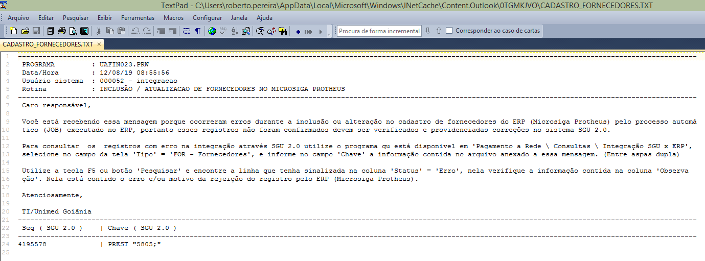

**LEIAUTE "FOR"**

Nesse documento vamos descrever a sequencia das execuções das tarefas para que ocorra a integração do SGU 2.0 para o ERP ( Protheus ).

Nesse leiaute são enviados os dados dos Médicos, Clínicas, Hospitais, Laboratórios, Unimed para serem integrados no  ERP. Sempre que ocorrer alguma alteração nos dados deles no SGU 2.0, são enviadas atualizações para o ERP de forma automática.

**01 - JOB** - DBAUNIMED.J_P_GERA_INTGRA_FORNEC deve estar ativo/habilitado no banco de dados do sistema SGU 2.0 para que os dados sejam enviados para tabela de integração.

Durante o processo de validação no ambiente de homologação este job foi ativado para ser executado a cada 10 minutos todo dia, mas quando tiver habilitado em produção pode ser que tenha outra periodicidade.


**02 - PROCEDURE**

Esse job executa a procedure "**P_GERA_INTGRA_FORNEC **" que pertence ao fornecedor pelo sistema SGU 2.0 (FESC). Portanto qualquer modificação nela deve ser pelo fornecedor do sistema SGU, A execução dessa procedure cria registros na tabela de integração no SGU **DBAUNIMED.INTGRA_SGU_ERP** com o status de "P" = Pendente no campo INTGR_IND_STATUS. Situação da qual o ERP vai identificar que há registros para serem integrados.

**03 - TABELA DE INTEGRACAO**

```
SELECT *
FROM   DBAUNIMED.INTGRA_SGU_ERP       ISE
WHERE  ISE.INTGR_IND                  = 'FOR'
AND    ISE.INTGR_IND_STATUS           = 'P'
```

Dados utilizados na integração são obtidos a partir dos campos **INTGR_DES_DADOS_SGU** e/ou **INTGR_DES_DADOS_ESPCFN** (Obs. O campo INTGR_DES_DADOS_ESPCFN vem preenchido somente quando há customizações feitas na FESC).


**04 - LEIAUTE DO CAMPO "INTGR_DES_DADOS_SGU"**

O fornecedor do sistema SGU 2.0 (FESC) disponibilizou um arquivo PDF com o leiaute e pode ser consultado no link abaixo.

[20180101_Integração_do_SGU_x_ERP.pdf](/protheus/protheus-unimed/wikis/uploads/24bde8c30878af8aee7ae2507abb700c/20180101_Integra%C3%A7%C3%A3o_do_SGU_x_ERP.pdf)

Na consulta ao manual em PDF pode ser que esteja desatualizado temporariamente em decorrência da atualizações de pacotes no SGU 2.0 e o tempo para que o fornecedor do sistema disponibilize o novo manual. Para contornar essa possível situação, pode ser executado os scripts abaixo, através deles é possível obter o leiaute atualizado.

**04.1 - Leiaute **

```
SELECT  PR.*
      , PS.COMAND_SQL
      , CURSOR ( SELECT *
                   FROM  DBAUNIMED.PTU_LAYOUT_DET PLD
                  WHERE  PLD.COD_ARQ = PS.COD_ARQ
                    AND  PLD.COD_REG = PS.COD_REG
                  ORDER  BY 1,2,3 )                             LAYOUT
FROM   PTU_LAYOUT_SQL PS
      ,PTU_LAYOUT_REG PR     
WHERE  PR.COD_ARQ = PS.COD_ARQ
AND    PR.COD_REG = PS.COD_REG
--> 91 (ENVIO SGU X ERP) 92 (RETORNO ERP X SGU)
AND    PS.COD_ARQ = 91  
--> LEIAUTE DE FORNECEDORES
AND    PR.SIG_REG LIKE '%INTGR_FOR%'
ORDER  BY 1, 2
```


| CAMPO | Objetivo |
|-------|----------|
| COD_ARQ | 91 - Código leiaute interno para dados exportados do SGU 2.0 para ERP |
| SIG_REG | INTGR_FOR - Sigla do cadastro interno do leiaute PF |
| DSC_REG | Descritivo do cadastro interno do leiaute |
| COMAND_SQL | Comando DML utilizado para gerar os registros na tabela de integração |
| LAYOUT | Estrutura de dados do leiaute interno |

**Dados do "LAYOUT"** - Os campos são separados por ponto e virgula (";")


## **05 - Importação dos dados no ERP**

Foi criada a rotina UAFIN023.PRW no Protheus para que ela leia os dados na view SIGA.V_INTGRA_SGU_ERP a qual faz referencia à tabela de integração do SGU 2.0 (DBAUNIMED.INTGRA_SGU_ERP), faz validações e escreve os dados na tabela de FORNECEDORES (SA2030) do ERP. Caso encontrei não conformidades nos dados durante a validação dados, o registro não é importado e informado na tabela de integração o motivo da não integração.

Essa rotina é executada através de JOB (APO_WSJOB) no Protheus, sendo feita a chamada pelo gerenciador de JOBs no Protheus na rotina UNI_JOB.PRW ou manualmente através de outra rotina UAFIN019 a qual está disponível no menu de usuário e ela faz a chamada da UAFIN023.

Para visualizar o código fonte das rotinas criadas, acesso os links abaixo:

[UNI_JOB.PRW - Gerenciador de JOBs no Protheus](https://labs.unimedgoiania.coop.br/ti/setsis/desenvolvimento/protheus/protheus-unimed/blob/master/ProjetoHOMOLOGA/ProjetoSGU%202.0/JOBs/UNIJOB.prw)

[UAFIN019.PRW - Gerenciador de rotinas da integração para execuções manuais](https://labs.unimedgoiania.coop.br/ti/setsis/desenvolvimento/protheus/protheus-unimed/blob/master/ProjetoHOMOLOGA/ProjetoSGU%202.0/Financeiro/Aplica%C3%A7%C3%B5es/UAFIN019.PRW)

[UAFIN023.PRW - Importação de dados no leiaute do SGU 2.0 dos fornecedores para SA2 via MsExecAuto.](https://labs.unimedgoiania.coop.br/ti/setsis/desenvolvimento/protheus/protheus-unimed/blob/master/ProjetoHOMOLOGA/ProjetoSGU%202.0/Financeiro/Aplica%C3%A7%C3%B5es/UAFIN023.PRW)

**05.1 - Validações dos dados pela rotina UAFIN023**

A rotina acessa a tabela de integrações (DBAUNIMED.INTGRA_SGU_ERP) do SGU 2.0 e verifica se há registros com status "P" (campo "INTGR_IND_STATUS" = "P", indica pendente de integração), se encontrar é feita a validação dados dados. Se os dados lidos estiveram em conformidade com as regras de validação o registro é inserido ou alterado no cadastro de fornecedores do Protheus (SA2). Caso encontre alguma não conformidade o registro não é importado, e o status é alterado para "E" (erro), na coluna de observação ("INTGR_DES_OBS") da tabela de integração é gravado o motivo do erro.

Na sequencia essa rotina envia e-mail para os endereços que estão previamente cadastrados no parâmetro "LS_ENDERECO_EMAIL_RESPONSAVEIS_INTEGRACAO_FORNECED" da tabela de parâmetros de integração (Z99030). Esse e-mail contém um arquivo texto anexo com instruções sobre como consultar o motivo de erro no SGU 2.0, bem como o código "CHAVE" para realizar a consulta.

Exemplo de um registro rejeitado




`Considerações:`
---

1 - Quando tiver integração do fornecedor e este tiver a origem uma `RESTITUIÇÃO DE VALOR`, e por acaso o ERP fizer a rejeição, ou seja, marcar na fila de integração `do `SGU ( intgra_sgu_erp ) status de "E" ( erro ). Deve proceder da seguinte forma:

1.1 - Fazer a correção do dado inconsistente  no cadastro da PESSOA, PESSOA_DOC, PESSOA_END, PREST, no SGU.

1.2 - Aguardar o envio de novo registro para integrar com ERP. Isso é feito através do job no SGU ( J_P_GERA_INTGRA_FORNEC ).

1.3 - Após a integração do fornecedor ter ocorrido com sucesso, pode enviar a integração do titulo à pagar.

1.4 - Se esse registro referente ao contas pagar (leiaute PAG), for rejeitado pelo ERP, deve-se proceder a correção do dado inconsistente no SGU e reenvia-lo através do programa "Operacional \Atualizações \Integra Contas Pagar com ERP: Restituição valores “.

Mais informações, consulte o chamado na FESC https://jira.fesctecnologia.com.br/servicedesk/customer/portal/21/S20GPLSUP-12447


Obs. Se não seguir essa ordem de execuções, não tem como dar certo. ( Boa sorte )

## **06 - Scripts Uteis**

Nesta seção contém alguns scripts uteis para a equipe de suporte:

06.1 - Script para forçar o envio dos dados do SGU para ERP ( SA2 - Cadastro de fornecedores )

**FORNECEDOR REEMBOLSO**
```
declare 
--------------------------------------------------------------------------------------------------------------------------------------------------
-- Data : 04/12/2020  Autor : Roberto Mar Pereira  Objetivo:  Forçar o envio dos dados do fornecedor do REEMBOLSO para fila integração do SGU 2.0
--------------------------------------------------------------------------------------------------------------------------------------------------
--  ORIENTAÇÕES:
--
--   1. para executar esse script, o usuário deve ter privilégio de "INSERT" na tabela "dbaunimed.his_audit_tab_intgra"
--
--   2. Após a execução desse script, deve-se aguardar o tempo de execução do JOB de integração de "Fornecedores" do SGU. O insert não envia dire
--      tamente para fila, deve aguardar o job.
--
--------------------------------------------------------------------------------------------------------------------------------------------------
  w_nro_reembolso   number(10) := 0;
begin
  w_nro_reembolso  := &NroReembolso;
  begin
    insert into dbaunimed.his_audit_tab_intgra ( hatbi_dth_atu
                                               , hatbi_nom_fisico_tab
                                               , hatbi_val_chave
                                               , hatbi_ind_tipo_audit
                                               , hatbi_ind_prcsso
                                               , hatbi_nom_fisico_tab_orig
                                               , hatbi_dth_atu_erp
                                               , prcp_cod
                                               , hatbi_qtde_erro
                                               , hatbi_msg_erro
                                               , hatbi_val_chave_orig )
                                   values     (  sysdate
                                               , 'REEMB'
                                               , to_char(w_nro_reembolso) ||';'
                                               , 'A'
                                               , 'INTGR_FOR'
                                               , 'REEMB'
                                               , to_date('01/01/0001', 'dd/mm/yyyy')
                                               , null
                                               , null
                                               , null
                                               , to_char(w_nro_reembolso) ||';' );
  exception 
    when others then
      raise_application_error(-20005,' Erro na inserção dos dados  : ' ||w_nro_reembolso ||sqlerrm);      
  end;        
  commit;       
end;  
```