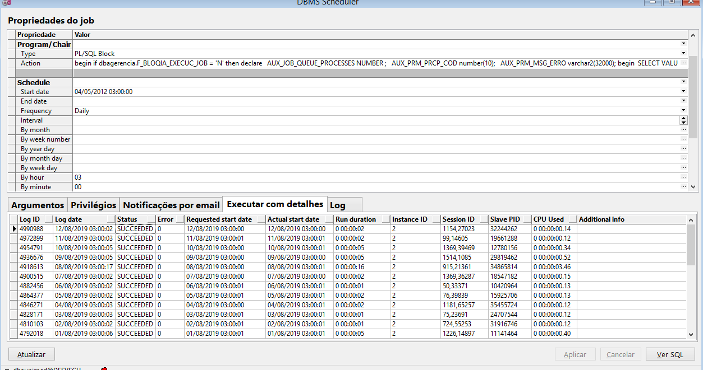
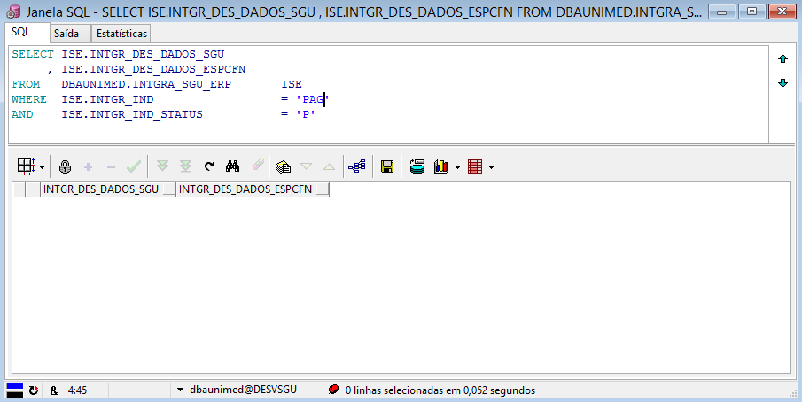
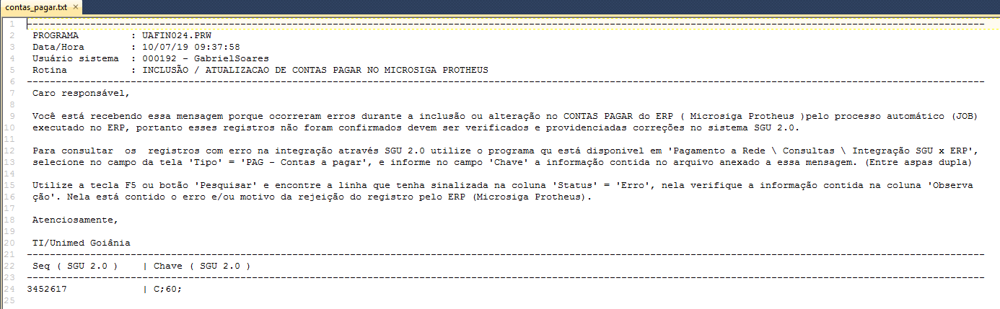

Nesse documento vamos descrever a sequência das execuções das tarefas para que ocorra a integração do SGU 2.0 para o ERP ( Protheus ).

Nesse leiaute são enviados os dados dos pagamentos gerados no SGU 2.0 a serem integrados com o ERP. São pagamentos diversos à Médicos, Clínicas, Laboratórios, Hospitais, Unimed, Reembolso e/ou Restituição. 

**01 - JOB** - J_GERA_INTGRA_CONTAS_PAGAR deve estar ativo/habilitado no banco de dados do sistema SGU 2.0 para que os dados sejam enviados para tabela de integração.

Durante o processo de validação no ambiente de homologação este job foi ativado para ser executado uma vez por dia, às 03h00 da manhã, mas quando tiver habilitado em produção pode ser que tenha outra periodicidade.



**02 - PROCEDURE**

Esse job executa a procedure "\*\*J_GERA_INTGRA_CONTAS_PAGAR \*\*" que pertence ao fornecedor do sistema SGU 2.0 (FESC). Portanto qualquer modificação nela deve ser pelo fornecedor do sistema SGU, A execução dessa procedure cria registros na tabela de integração no SGU **DBAUNIMED.INTGRA_SGU_ERP** com o status de "P" = Pendente no campo INTGR_IND_STATUS. Situação da qual o ERP vai identificar que há registros para serem integrados.

**03 - TABELA DE INTEGRACAO**

```
SELECT *
FROM   DBAUNIMED.INTGRA_SGU_ERP       ISE
WHERE  ISE.INTGR_IND                  = 'PAG'
AND    ISE.INTGR_IND_STATUS           = 'P'
```

Dados utilizados na integração são obtidos a partir dos campos **INTGR_DES_DADOS_SGU** e/ou **INTGR_DES_DADOS_ESPCFN** (Obs. O campo INTGR_DES_DADOS_ESPCFN vem preenchido somente quando há customizações feitas na FESC).


**04 - LEIAUTE DO CAMPO "INTGR_DES_DADOS_SGU"**


O fornecedor do sistema SGU 2.0 (FESC) disponibilizou um arquivo PDF com o leiaute e pode ser consultado no link abaixo.

[20180101_Integração_do_SGU_x_ERP.pdf](/protheus/protheus-unimed/wikis/protheus/protheus-unimed/wikis/uploads/24bde8c30878af8aee7ae2507abb700c/20180101_Integra%C3%A7%C3%A3o_do_SGU_x_ERP.pdf)

Na consulta ao manual em PDF pode ser que esteja desatualizado temporariamente em decorrência da atualizações de pacotes no SGU 2.0 e o tempo para que o fornecedor do sistema disponibilize o novo manual. Para contornar essa possível situação, pode ser executado os scripts abaixo, através deles é possível obter o leiaute atualizado.

**04.1 - INTGR_PAG - Registro de Integração - Contas a Pagar (Pagamento Médico)**

``````
SELECT  PR.*
      , PS.COMAND_SQL
      , CURSOR ( SELECT *
                   FROM  DBAUNIMED.PTU_LAYOUT_DET PLD
                  WHERE  PLD.COD_ARQ = PS.COD_ARQ
                    AND  PLD.COD_REG = PS.COD_REG
                  ORDER  BY 1,2,3 )                             LAYOUT
FROM   PTU_LAYOUT_SQL PS
      ,PTU_LAYOUT_REG PR     
WHERE  PR.COD_ARQ = PS.COD_ARQ
AND    PR.COD_REG = PS.COD_REG
--> 91 (ENVIO SGU X ERP) 92 (RETORNO ERP X SGU)
AND    PS.COD_ARQ = 91  
--> LEIAUTE DE PAGAMENTO MÉDICO
AND    PR.SIG_REG LIKE '%INTGR_PAG%'
ORDER  BY 1, 2
``````

**04.2 - INTGR_AFU - Registro de Integração - Contas a Pagar (AFU - Auxílio Funeral)**

``````
SELECT  PR.*
      , PS.COMAND_SQL
      , CURSOR ( SELECT *
                   FROM  DBAUNIMED.PTU_LAYOUT_DET PLD
                  WHERE  PLD.COD_ARQ = PS.COD_ARQ
                    AND  PLD.COD_REG = PS.COD_REG
                  ORDER  BY 1,2,3 )                             LAYOUT
FROM   PTU_LAYOUT_SQL PS
      ,PTU_LAYOUT_REG PR     
WHERE  PR.COD_ARQ = PS.COD_ARQ
AND    PR.COD_REG = PS.COD_REG
--> 91 (ENVIO SGU X ERP) 92 (RETORNO ERP X SGU)
AND    PS.COD_ARQ = 91  
--> LEIAUTE DE PAGAMENTO MÉDICO
AND    PR.SIG_REG LIKE '%INTGR_AFU%'
ORDER  BY 1, 2
``````

**04.3 - INTGR_AFA - Registro de Integração - Contas a Pagar (AFA - Adiant do Auxílio Funeral)**

``````
SELECT  PR.*
      , PS.COMAND_SQL
      , CURSOR ( SELECT *
                   FROM  DBAUNIMED.PTU_LAYOUT_DET PLD
                  WHERE  PLD.COD_ARQ = PS.COD_ARQ
                    AND  PLD.COD_REG = PS.COD_REG
                  ORDER  BY 1,2,3 )                             LAYOUT
FROM   PTU_LAYOUT_SQL PS
      ,PTU_LAYOUT_REG PR     
WHERE  PR.COD_ARQ = PS.COD_ARQ
AND    PR.COD_REG = PS.COD_REG
--> 91 (ENVIO SGU X ERP) 92 (RETORNO ERP X SGU)
AND    PS.COD_ARQ = 91  
--> LEIAUTE DE PAGAMENTO MÉDICO
AND    PR.SIG_REG LIKE '%INTGR_AFA%'
ORDER  BY 1, 2
``````

**04.4 - INTGR_LAF - Registro de Integração - Contas a Pagar (Adiant. Fornecedor)**

``````
SELECT  PR.*
      , PS.COMAND_SQL
      , CURSOR ( SELECT *
                   FROM  DBAUNIMED.PTU_LAYOUT_DET PLD
                  WHERE  PLD.COD_ARQ = PS.COD_ARQ
                    AND  PLD.COD_REG = PS.COD_REG
                  ORDER  BY 1,2,3 )                             LAYOUT
FROM   PTU_LAYOUT_SQL PS
      ,PTU_LAYOUT_REG PR     
WHERE  PR.COD_ARQ = PS.COD_ARQ
AND    PR.COD_REG = PS.COD_REG
--> 91 (ENVIO SGU X ERP) 92 (RETORNO ERP X SGU)
AND    PS.COD_ARQ = 91  
--> LEIAUTE DE PAGAMENTO MÉDICO
AND    PR.SIG_REG LIKE '%INTGR_LAF%'
ORDER  BY 1, 2
``````

**04.5 - INTGR_REE - Registro de Integração - Reembolso**

``````
SELECT  PR.*
      , PS.COMAND_SQL
      , CURSOR ( SELECT *
                   FROM  DBAUNIMED.PTU_LAYOUT_DET PLD
                  WHERE  PLD.COD_ARQ = PS.COD_ARQ
                    AND  PLD.COD_REG = PS.COD_REG
                  ORDER  BY 1,2,3 )                             LAYOUT
FROM   PTU_LAYOUT_SQL PS
      ,PTU_LAYOUT_REG PR     
WHERE  PR.COD_ARQ = PS.COD_ARQ
AND    PR.COD_REG = PS.COD_REG
--> 91 (ENVIO SGU X ERP) 92 (RETORNO ERP X SGU)
AND    PS.COD_ARQ = 91  
--> LEIAUTE DE PAGAMENTO MÉDICO
AND    PR.SIG_REG LIKE '%INTGR_REE%'
ORDER  BY 1, 2
``````

**04.6 - INTGR_INT - Registro de Integração - Intercâmbio**

``````
SELECT  PR.*
      , PS.COMAND_SQL
      , CURSOR ( SELECT *
                   FROM  DBAUNIMED.PTU_LAYOUT_DET PLD
                  WHERE  PLD.COD_ARQ = PS.COD_ARQ
                    AND  PLD.COD_REG = PS.COD_REG
                  ORDER  BY 1,2,3 )                             LAYOUT
FROM   PTU_LAYOUT_SQL PS
      ,PTU_LAYOUT_REG PR     
WHERE  PR.COD_ARQ = PS.COD_ARQ
AND    PR.COD_REG = PS.COD_REG
--> 91 (ENVIO SGU X ERP) 92 (RETORNO ERP X SGU)
AND    PS.COD_ARQ = 91  
--> LEIAUTE DE PAGAMENTO REEMBOLSO
AND    PR.SIG_REG LIKE '%INTGR_INT%'
ORDER  BY 1, 2
``````

**04.7 - INTGR_REMO- Registro de Integração - Remoção**

``````
SELECT  PR.*
      , PS.COMAND_SQL
      , CURSOR ( SELECT *
                   FROM  DBAUNIMED.PTU_LAYOUT_DET PLD
                  WHERE  PLD.COD_ARQ = PS.COD_ARQ
                    AND  PLD.COD_REG = PS.COD_REG
                  ORDER  BY 1,2,3 )                             LAYOUT
FROM   PTU_LAYOUT_SQL PS
      ,PTU_LAYOUT_REG PR     
WHERE  PR.COD_ARQ = PS.COD_ARQ
AND    PR.COD_REG = PS.COD_REG
--> 91 (ENVIO SGU X ERP) 92 (RETORNO ERP X SGU)
AND    PS.COD_ARQ = 91  
--> LEIAUTE DE PAGAMENTO INTERCAMBIO
AND    PR.SIG_REG LIKE '%INTGR_REMO%'
ORDER  BY 1, 2
``````

**04.8 - INTGR_DEB - Registro de Integração - Nota Débito**

``````
SELECT  PR.*
      , PS.COMAND_SQL
      , CURSOR ( SELECT *
                   FROM  DBAUNIMED.PTU_LAYOUT_DET PLD
                  WHERE  PLD.COD_ARQ = PS.COD_ARQ
                    AND  PLD.COD_REG = PS.COD_REG
                  ORDER  BY 1,2,3 )                             LAYOUT
FROM   PTU_LAYOUT_SQL PS
      ,PTU_LAYOUT_REG PR     
WHERE  PR.COD_ARQ = PS.COD_ARQ
AND    PR.COD_REG = PS.COD_REG
--> 91 (ENVIO SGU X ERP) 92 (RETORNO ERP X SGU)
AND    PS.COD_ARQ = 91  
--> LEIAUTE DE PAGAMENTO REMOÇÃO
AND    PR.SIG_REG LIKE '%INTGR_DEB%'
ORDER  BY 1, 2
``````

**04.9 - INTGR_RVB - Registro de Integração - Restituição de Valores**

``````
SELECT  PR.*
      , PS.COMAND_SQL
      , CURSOR ( SELECT *
                   FROM  DBAUNIMED.PTU_LAYOUT_DET PLD
                  WHERE  PLD.COD_ARQ = PS.COD_ARQ
                    AND  PLD.COD_REG = PS.COD_REG
                  ORDER  BY 1,2,3 )                             LAYOUT
FROM   PTU_LAYOUT_SQL PS
      ,PTU_LAYOUT_REG PR     
WHERE  PR.COD_ARQ = PS.COD_ARQ
AND    PR.COD_REG = PS.COD_REG
--> 91 (ENVIO SGU X ERP) 92 (RETORNO ERP X SGU)
AND    PS.COD_ARQ = 91  
--> LEIAUTE DE PAGAMENTO NOTA DE DEBITO
AND    PR.SIG_REG LIKE '%INTGR_RVB%'
ORDER  BY 1, 2
``````
**04.10 - INTGR_NFA - Registro de Integração - Nota Fiscal Adiantamento Forn**

``````
SELECT  PR.*
      , PS.COMAND_SQL
      , CURSOR ( SELECT *
                   FROM  DBAUNIMED.PTU_LAYOUT_DET PLD
                  WHERE  PLD.COD_ARQ = PS.COD_ARQ
                    AND  PLD.COD_REG = PS.COD_REG
                  ORDER  BY 1,2,3 )                             LAYOUT
FROM   PTU_LAYOUT_SQL PS
      ,PTU_LAYOUT_REG PR     
WHERE  PR.COD_ARQ = PS.COD_ARQ
AND    PR.COD_REG = PS.COD_REG
--> 91 (ENVIO SGU X ERP) 92 (RETORNO ERP X SGU)
AND    PS.COD_ARQ = 91  
--> LEIAUTE DE PAGAMENTO DETERMINAÇÃO JUDICIAL
AND    PR.SIG_REG LIKE '%INTGR_NFA%'
ORDER  BY 1, 2
``````

**04.11 - INTGR_MAT - Registro de Integração - Materiais e Medicamentos**

``````
SELECT  PR.*
      , PS.COMAND_SQL
      , CURSOR ( SELECT *
                   FROM  DBAUNIMED.PTU_LAYOUT_DET PLD
                  WHERE  PLD.COD_ARQ = PS.COD_ARQ
                    AND  PLD.COD_REG = PS.COD_REG
                  ORDER  BY 1,2,3 )                             LAYOUT
FROM   PTU_LAYOUT_SQL PS
      ,PTU_LAYOUT_REG PR     
WHERE  PR.COD_ARQ = PS.COD_ARQ
AND    PR.COD_REG = PS.COD_REG
--> 91 (ENVIO SGU X ERP) 92 (RETORNO ERP X SGU)
AND    PS.COD_ARQ = 91  
--> LEIAUTE DE PAGAMENTO RESTITUIÇÃO DE VALORES
AND    PR.SIG_REG LIKE '%INTGR_MAT%'
ORDER  BY 1, 2
``````


**04.12 - INTGR_GFR - Registro de Integração - Guias fora da rede**

``````
SELECT  PR.*
      , PS.COMAND_SQL
      , CURSOR ( SELECT *
                   FROM  DBAUNIMED.PTU_LAYOUT_DET PLD
                  WHERE  PLD.COD_ARQ = PS.COD_ARQ
                    AND  PLD.COD_REG = PS.COD_REG
                  ORDER  BY 1,2,3 )                             LAYOUT
FROM   PTU_LAYOUT_SQL PS
      ,PTU_LAYOUT_REG PR     
WHERE  PR.COD_ARQ = PS.COD_ARQ
AND    PR.COD_REG = PS.COD_REG
--> 91 (ENVIO SGU X ERP) 92 (RETORNO ERP X SGU)
AND    PS.COD_ARQ = 91  
--> LEIAUTE DE PAGAMENTO RESTITUIÇÃO DE VALORES
AND    PR.SIG_REG LIKE '%INTGR_GFR%'
ORDER  BY 1, 2
``````

**04.13 - INTGR_DJU - Registro de Integração - Determinação Judicial**

``````
SELECT  PR.*
      , PS.COMAND_SQL
      , CURSOR ( SELECT *
                   FROM  DBAUNIMED.PTU_LAYOUT_DET PLD
                  WHERE  PLD.COD_ARQ = PS.COD_ARQ
                    AND  PLD.COD_REG = PS.COD_REG
                  ORDER  BY 1,2,3 )                             LAYOUT
FROM   PTU_LAYOUT_SQL PS
      ,PTU_LAYOUT_REG PR     
WHERE  PR.COD_ARQ = PS.COD_ARQ
AND    PR.COD_REG = PS.COD_REG
--> 91 (ENVIO SGU X ERP) 92 (RETORNO ERP X SGU)
AND    PS.COD_ARQ = 91  
--> LEIAUTE DE PAGAMENTO RESTITUIÇÃO DE VALORES
AND    PR.SIG_REG LIKE '%INTGR_DJU%'
ORDER  BY 1, 2
``````
**04.14 - INTGR_GLR - Registro de Integração - Glosas Recebidas**

``````
SELECT  PR.*
      , PS.COMAND_SQL
      , CURSOR ( SELECT *
                   FROM  DBAUNIMED.PTU_LAYOUT_DET PLD
                  WHERE  PLD.COD_ARQ = PS.COD_ARQ
                    AND  PLD.COD_REG = PS.COD_REG
                  ORDER  BY 1,2,3 )                             LAYOUT
FROM   PTU_LAYOUT_SQL PS
      ,PTU_LAYOUT_REG PR     
WHERE  PR.COD_ARQ = PS.COD_ARQ
AND    PR.COD_REG = PS.COD_REG
--> 91 (ENVIO SGU X ERP) 92 (RETORNO ERP X SGU)
AND    PS.COD_ARQ = 91  
--> LEIAUTE DE PAGAMENTO RESTITUIÇÃO DE VALORES
AND    PR.SIG_REG LIKE '%INTGR_GLR%'
ORDER  BY 1, 2
``````


## **05 - Importação dos dados no ERP**

Foi criada a rotina UAFIN024.PRW no Protheus para que ela leia os dados na view de integração do SGU 2.0 (V_INTGRA_SGU_ERP), fazer validações e escrever os dados na tabela de CONTAS A RECEBER (SE1030) do ERP. Caso encontrei não conformidades nos dados durante a validação dados, o registro não é importado e gravado na tabela de integração o motivo da não integração.

Essa rotina é executada através de JOB (APO_WSJOB) no Protheus, sendo feita a chamada pelo gerenciador de JOBs no Protheus na rotina UNI_JOB.PRW ou manualmente através de outra rotina UAFIN019 a qual está disponível no menu de usuário e ela faz a chamada da UAFIN024.

Para visualizar o código fonte das rotinas criadas, acesso os links abaixo:

[UNI_JOB.PRW - Gerenciador de JOBs no Protheus](https://labs.unimedgoiania.coop.br/ti/setsis/desenvolvimento/protheus/protheus-unimed/blob/master/ProjetoHOMOLOGA/ProjetoSGU%202.0/JOBs/UNIJOB.prw)

[UAFIN019.PRW - Gerenciador de rotinas da integração para execuções manuais](https://labs.unimedgoiania.coop.br/ti/setsis/desenvolvimento/protheus/protheus-unimed/blob/master/ProjetoHOMOLOGA/ProjetoSGU%202.0/Financeiro/Aplica%C3%A7%C3%B5es/UAFIN019.PRW)

[UAFIN024.PRW - Importação de dados no leiaute do SGU 2.0 dos pagamentos para SE2, não usa MsExecAuto.](https://labs.unimedgoiania.coop.br/ti/setsis/desenvolvimento/protheus/protheus-unimed/blob/master/ProjetoHOMOLOGA/ProjetoSGU%202.0/Financeiro/Aplica%C3%A7%C3%B5es/UAFIN024.PRW)

**05.1 - Validações dos dados pela rotina UAFIN024**

A rotina acessa a view V_INTGRA_SGU_ERP, a qual faz referência a tabela de integrações (DBAUNIMED.INTGRA_SGU_ERP) do SGU 2.0 e verifica se há registros com status "P" (campo "INTGR_IND_STATUS" = "P", indica pendente de integração), se encontrar é feita a validação dados dados. Se os dados lidos estiveram em conformidade com as regras de validação o registro é inserido ou alterado no contas a pagar do Protheus (SE1). Caso encontre alguma não conformidade o registro não é importado, e o status é alterado para "E" (erro), na coluna de observação ("INTGR_DES_OBS") da tabela de integração é gravado o motivo do erro.

Na sequencia essa rotina envia e-mail para os endereços que estão previamente cadastrados no parâmetro "LS_ENDERECO_EMAIL_RESPONSAVEIS_INTEGRACAO_FORNECED" da tabela de parâmetros de integração (Z99030). Esse e-mail contém um arquivo texto anexo com instruções sobre como consultar o motivo de erro no SGU 2.0, bem como o código "CHAVE" para realizar a consulta.

Exemplo de um registro rejeitado



