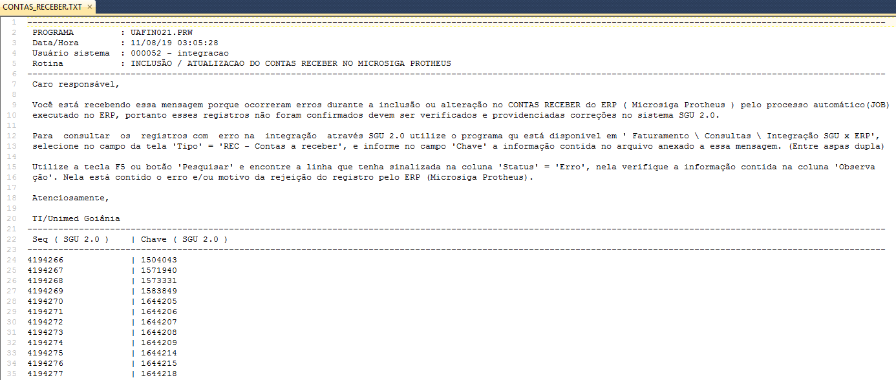

Nesse documento vamos descrever a sequência das execuções das tarefas para que ocorra a integração do SGU 2.0 para o ERP ( Protheus ).

Nesse leiaute são enviados os dados das faturas geradas no SGU 2.0 a serem integrados com o ERP. São faturas dos clientes pessoa física, jurídica e intercâmbio ( Outra Unimed ). Para que a fatura seja enviada para a integração, ela deve ter sido gerada a "capa da fatura".

**01 - JOB** - J_GERA_INTGRA_CONTAS_RECEB deve estar ativo/habilitado no banco de dados do sistema SGU 2.0 para que os dados sejam enviados para tabela de integração.

Durante o processo de validação no ambiente de homologação este job foi ativado para ser executado uma vez por semana, às 03h00 da manhã, todo domingo, mas quando tiver habilitado em produção pode ser que tenha outra periodicidade.


**02 - PROCEDURE**

Esse job executa a procedure "**J_GERA_INTGRA_CONTAS_RECEB **" que pertence ao fornecedor do sistema SGU 2.0 (FESC). Portanto qualquer modificação nela deve ser pelo fornecedor do sistema SGU, A execução dessa procedure cria registros na tabela de integração no SGU **DBAUNIMED.INTGRA_SGU_ERP** com o status de "P" = Pendente no campo INTGR_IND_STATUS. Situação da qual o ERP vai identificar que há registros para serem integrados.

**03 - TABELA DE INTEGRACAO**

```
SELECT *
FROM   DBAUNIMED.INTGRA_SGU_ERP       ISE
WHERE  ISE.INTGR_IND                  = 'REC'
AND    ISE.INTGR_IND_STATUS           = 'P'
```

Dados utilizados na integração são obtidos a partir dos campos **INTGR_DES_DADOS_SGU** e/ou **INTGR_DES_DADOS_ESPCFN** (Obs. O campo INTGR_DES_DADOS_ESPCFN vem preenchido somente quando há customizações feitas na FESC).


**04 - LEIAUTE DO CAMPO "INTGR_DES_DADOS_SGU"**

O fornecedor do sistema SGU 2.0 (FESC) disponibilizou um arquivo PDF com o leiaute e pode ser consultado no link abaixo.

[20180101_Integração_do_SGU_x_ERP.pdf](/protheus/protheus-unimed/wikis/uploads/24bde8c30878af8aee7ae2507abb700c/20180101_Integra%C3%A7%C3%A3o_do_SGU_x_ERP.pdf)

Na consulta ao manual em PDF pode ser que esteja desatualizado temporariamente em decorrência da atualizações de pacotes no SGU 2.0 e o tempo para que o fornecedor do sistema disponibilize o novo manual. Para contornar essa possível situação, pode ser executado os scripts abaixo, através deles é possível obter o leiaute atualizado.

**04.1 - Leiaute fatura PESSOA FÍSICA**

```
SELECT  PR.*
      , PS.COMAND_SQL
      , CURSOR ( SELECT *
                   FROM  DBAUNIMED.PTU_LAYOUT_DET PLD
                  WHERE  PLD.COD_ARQ = PS.COD_ARQ
                    AND  PLD.COD_REG = PS.COD_REG
                  ORDER  BY 1,2,3 )                             LAYOUT
FROM   PTU_LAYOUT_SQL PS
      ,PTU_LAYOUT_REG PR     
WHERE  PR.COD_ARQ = PS.COD_ARQ
AND    PR.COD_REG = PS.COD_REG
--> 91 (ENVIO SGU X ERP) 92 (RETORNO ERP X SGU)
AND    PS.COD_ARQ = 91  
--> LEIAUTE DE FATURA PESSOA FISICA
AND    PR.SIG_REG = 'INTGR_RECF'
ORDER  BY 1, 2
```


| CAMPO | Objetivo |
|-------|----------|
| COD_ARQ | 91 - Código leiaute interno para dados exportados do SGU 2.0 para ERP |
| SIG_REG | INTGR_RECF- Sigla do cadastro interno do leiaute PF |
| DSC_REG | Descritivo do cadastro interno do leiaute |
| COMAND_SQL | Comando DML utilizado para gerar os registros na tabela de integração |
| LAYOUT | Estrutura de dados do leiaute interno |

**Dados do "LAYOUT"** - Os campos são separados por ponto e virgula (";")


**04.2 - Leiaute fatura PESSOA JURÍDICA**

```
SELECT  PR.*
      , PS.COMAND_SQL
      , CURSOR ( SELECT *
                   FROM  DBAUNIMED.PTU_LAYOUT_DET PLD
                  WHERE  PLD.COD_ARQ = PS.COD_ARQ
                    AND  PLD.COD_REG = PS.COD_REG
                  ORDER  BY 1,2,3 )                             LAYOUT
FROM   PTU_LAYOUT_SQL PS
      ,PTU_LAYOUT_REG PR     
WHERE  PR.COD_ARQ = PS.COD_ARQ
AND    PR.COD_REG = PS.COD_REG
--> 91 (ENVIO SGU X ERP) 92 (RETORNO ERP X SGU)
AND    PS.COD_ARQ = 91  
--> LEIAUTE DE FATURA PESSOA JURÍDICA
AND    PR.SIG_REG = 'INTGR_RECJ'
ORDER  BY 1, 2
```


| CAMPO | Objetivo |
|-------|----------|
| COD_ARQ | 91 - Código leiaute interno para dados exportados do SGU 2.0 para ERP |
| SIG_REG | INTGR_RECJ- Sigla do cadastro interno do leiaute PF |
| DSC_REG | Descritivo do cadastro interno do leiaute |
| COMAND_SQL | Comando DML utilizado para gerar os registros na tabela de integração |
| LAYOUT | Estrutura de dados do leiaute interno |

**Dados do "LAYOUT"** - Os campos são separados por ponto e virgula (";")


**04.3 - Leiaute fatura UNIMED ( Intercâmbio )**

```
SELECT  PR.*
      , PS.COMAND_SQL
      , CURSOR ( SELECT *
                   FROM  DBAUNIMED.PTU_LAYOUT_DET PLD
                  WHERE  PLD.COD_ARQ = PS.COD_ARQ
                    AND  PLD.COD_REG = PS.COD_REG
                  ORDER  BY 1,2,3 )                             LAYOUT
FROM   PTU_LAYOUT_SQL PS
      ,PTU_LAYOUT_REG PR     
WHERE  PR.COD_ARQ = PS.COD_ARQ
AND    PR.COD_REG = PS.COD_REG
--> 91 (ENVIO SGU X ERP) 92 (RETORNO ERP X SGU)
AND    PS.COD_ARQ = 91  
--> LEIAUTE DE FATURA INTERCAMBIO ( UNIMED )
AND    PR.SIG_REG = 'INTGR_RECU'
ORDER  BY 1, 2
```


| CAMPO | Objetivo |
|-------|----------|
| COD_ARQ | 91 - Código leiaute interno para dados exportados do SGU 2.0 para ERP |
| SIG_REG | INTGR_RECU- Sigla do cadastro interno do leiaute PF |
| DSC_REG | Descritivo do cadastro interno do leiaute |
| COMAND_SQL | Comando DML utilizado para gerar os registros na tabela de integração |
| LAYOUT | Estrutura de dados do leiaute interno |

**Dados do "LAYOUT"** - Os campos são separados por ponto e virgula (";")


**04.4 - Leiaute ESPECIFICO para faturas PESSOA FÍSICA, JURÍDICA E UNIMED ( Intercâmbio )**

Foi criado leiaute específico para a Unimed Goiânia ( customização ), esse leiaute envia os dados do endereço de faturamento. Ou seja, o mesmo endereço que é impresso na fatura/boleto do SGU 2.0 será enviado para integração com o ERP. Essa necessidade foi percebida durante a homologação de clientes que possui vários contratos, e esses contratos com faturas em endereços diferentes. O problema foi detectado quando foram gerados arquivos CNAB240 para registrar nos bancos de cobrança.

A configuração desse leiaute especifico foi implementado da seguinte forma:

- Acessar o sistema SGU 2.0, em "Administração \Cadastros \Parâmetros da integração com o ERP" e procurar por "RECEBER", conforme tela abaixo:


Se o campo "Valor" estiver preenchido com o nome da procedure, indica que há uma customização no contas a receber.

Para obter os campos que compõe o leiaute específico, deve-se conectar no banco de dados do SGU e procurar pelo nome da PROCEDURE especifica e abrir o código. Para enviar os dados referente ao endereço de faturamento, foi criada uma view, onde é executada o código abaixo:
``````
SELECT V.EFR_DES_RUA_SACADO
      ,V.EFR_DES_CMPLMN_SACADO
      ,V.EFR_NRO_END_SACADO
      ,V.EFR_DES_BAIRRO_SACADO
      ,V.EFR_NRO_CEP_SACADO
      ,V.EFR_DES_CIDAD_SACADO
      ,V.EFR_DES_UF_SACADO
      ,V.EFR_CX_POSTAL_SACADO
FROM V_EMIS_FATURA_REC V
WHERE V.EFR_NRO = < numero da fatura >

``````
## **05 - Importação dos dados no ERP**

Foi criada a rotina UAFIN021.PRW no Protheus para que ela leia os dados na view de integração do SGU 2.0 (V_INTGRA_SGU_ERP), fazer validações e escrever os dados na tabela de CONTAS A RECEBER (SE1030) do ERP. Caso encontrei não conformidades nos dados durante a validação dados, o registro não é importado e gravado na tabela de integração o motivo da não integração.

Essa rotina é executada através de JOB (APO_WSJOB) no Protheus, sendo feita a chamada pelo gerenciador de JOBs no Protheus na rotina UNI_JOB.PRW ou manualmente através de outra rotina UAFIN019 a qual está disponível no menu de usuário e ela faz a chamada da UAFIN021.

Para visualizar o código fonte das rotinas criadas, acesso os links abaixo:

[UNI_JOB.PRW - Gerenciador de JOBs no Protheus](https://labs.unimedgoiania.coop.br/ti/setsis/desenvolvimento/protheus/protheus-unimed/blob/master/ProjetoHOMOLOGA/ProjetoSGU%202.0/JOBs/UNIJOB.prw)

[UAFIN019.PRW - Gerenciador de rotinas da integração para execuções manuais](https://labs.unimedgoiania.coop.br/ti/setsis/desenvolvimento/protheus/protheus-unimed/blob/master/ProjetoHOMOLOGA/ProjetoSGU%202.0/Financeiro/Aplica%C3%A7%C3%B5es/UAFIN019.PRW)

[UAFIN021.PRW - Importação de dados no leiaute do SGU 2.0 das faturas para SE1, não usa MsExecAuto.](https://labs.unimedgoiania.coop.br/ti/setsis/desenvolvimento/protheus/protheus-unimed/blob/master/ProjetoHOMOLOGA/ProjetoSGU%202.0/Financeiro/Aplica%C3%A7%C3%B5es/UAFIN021.PRW)


**05.1 - Validações dos dados pela rotina UAFIN021**

A rotina acessa a view V_INTGRA_SGU_ERP, a qual faz referência a tabela de integrações (DBAUNIMED.INTGRA_SGU_ERP) do SGU 2.0 e verifica se há registros com status "P" (campo "INTGR_IND_STATUS" = "P", indica pendente de integração), se encontrar é feita a validação dados dados. Se os dados lidos estiveram em conformidade com as regras de validação o registro é inserido ou alterado no contas a receber do Protheus (SE1). Caso encontre alguma não conformidade o registro não é importado, e o status é alterado para "E" (erro), na coluna de observação ("INTGR_DES_OBS") da tabela de integração é gravado o motivo do erro.

Na sequencia essa rotina envia e-mail para os endereços que estão previamente cadastrados no parâmetro "LS_ENDERECO_EMAIL_RESPONSAVEIS_INTEGRACAO_CLIENTES" da tabela de parâmetros de integração (Z99030). Esse e-mail contém um arquivo texto anexo com instruções sobre como consultar o motivo de erro no SGU 2.0, bem como o código "CHAVE" para realizar a consulta.

Exemplo de um registro rejeitado




## **06 - SCRIPTs uteis p/ suporte**
---

Um problema muito comum na época da implantação, o pessoal gera a fatura com endereço incompleto. No SGU não emite nenhuma alerta, o problema começa quando ocorre a integração com ERP, este faz a validação dos dados da fatura; o endereço é um deles, ou seja, se tiver incompleto a integração não ocorre.

Nesse caso, pode utilizar esse script para consulta a tabela e os dados do endereço gravado na fatura, e decidir se orienta o setor a fazer o cancelamento da fatura ou faz update na tabela.

```
select e.efr_nro                        fatura 
     , e.efr_des_rua_sacado
     , e.efr_des_cmplmn_sacado
     , e.efr_nro_end_sacado
     , e.efr_des_bairro_sacado
     , e.efr_nro_cep_sacado
     , e.efr_des_cidad_sacado
     , e.efr_des_uf_sacado

from   emis_fatura_rec_base             e
where  e.efr_nro                        in ( 18235683, 18236470 )
FOR UPDATE
```

## **MELHORIA APÓS IMPLANTAÇÃO**
---

Foram criados dois botões na rotina de "CTRL REM/RET" para agilizar o processo de integração avulso. Segue conforme especificado:


**ATIVIDADE 1** - Criar um botão na rotina “Controle de REM/RET” para acionar as rotinas de citadas nas ações 1 e 2, no mesmo processamento. Ou seja, ao acionar o botão; deve vir uma tela com parâmetros/filtros (conforme protótipo1) e após confirmar a execução, as ações 1 e 2 serão processadas, no final emitindo avisos de bem sucedido ou mal sucedido.

**Ação 1** – Transferência (FINA060), utilizar MsExecauto(padrão TOTVS )

**Ação 2** – Cancelamento da integração, executar as mesmas regras de validação contidas na rotina UAFIN022.


**ATIVIDADE 2** – Criar um botão na rotina de “Controle de REM/RET” para realizar a integração “instantânea”, ou seja, não precisa de aguardar o JOB (5 minutos).  Ao acionar o botão; deve vir uma tela com parâmetros/filtros (conforme protótipo1) e um botão para confirmar a execução. E no final emitir um aviso de “integração bem sucedida” ou “integração mal sucedida”.

**Ação 4** – Após o envio da integração do SGU 2.0 para o ERP, o colaborador deve ter a tela descrita para informar o número da fatura aleatoriamente ou por intervalo. E botão para executar a integração.  As regras a serem consideradas nesta atividade são as mesmas da rotina de integração por JOB. (UAFIN021).