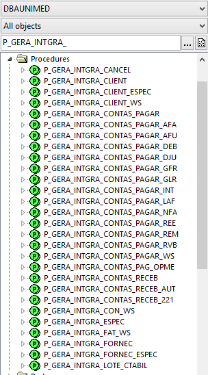
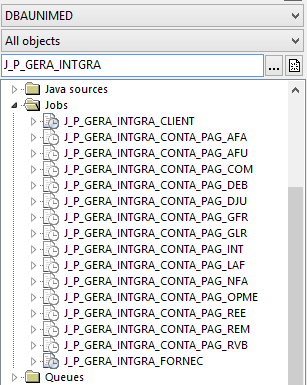
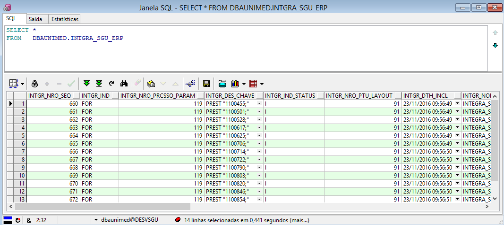
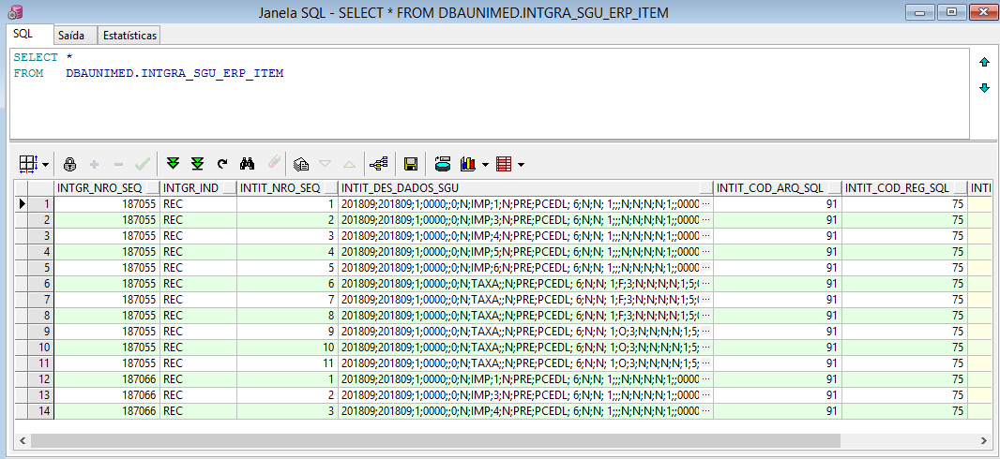

Nesta seção vamos descrever os objetos de banco de dados ORACLE desenvolvidos pelo fornecedor do sistema SGU 2.0, será uma explicação básica das funcionalidades e TI/Goiânia não pode alterar qualquer objeto nesse banco de dados dos quais não foram criados pela própria TI/Goiânia. Isso deve ser feito pelo fornecedor do sistema.

Os objetos ficam no usuário/schema do banco de dados:

Usuário/Schema: "DBAUNIMED"

**PROCEDURE:**

Existem várias procedures de integração, elas serão descritas com mais detalhes nas páginas que correspondem a cada leiaute. Para saber quais procedures são utilizadas, deve-se fazer a pesquisa no banco de dados com as iniciais "P_GERA_INTGRA*"



**JOB:**

Existem vários JOBs no banco de dados, eles serão descritos com mais detalhes nas páginas que correspondem a cada leiaute. Para saber quais jobs estão ativos e/ou utilizados, deve-se fazer a pesquisa no banco de dados com as iniciais.

"J_P_GERA_INTGRA*"



**TABELAS:**

**Tabela : INTGRA_SGU_ERP**

Tabela de integração do SGU 2.0 para o ERP


``````
SELECT *
FROM   DBAUNIMED.INTGRA_SGU_ERP
``````



**Campos:**

``````
SQL> desc dbaunimed.intgra_sgu_erp
Name                    Comments                                                                                                                     
----------------------  ---------------------------------------------------------------------------------------------------------------------------- 
INTGR_NRO_SEQ           Seq.: Código sequencial do registro                                                                                          
INTGR_IND               Tipo: Tipo de integração (FOR, CLI, PAG, REC, CON)                                                                           
INTGR_NRO_PRCSSO_PARAM  Processo: Código do processo que gerou o registro                                                                            
INTGR_DES_CHAVE         Chave: Chave que identifica o registro exportado. Ex.: Quando o tipo for REC, neste campo terá o número da fatura            
INTGR_IND_STATUS        Status: P=Pendente, A=Aguardando retorno, E=Erro ao integrar, C=Cancelado, I=Integrado ao ERP                                
INTGR_NRO_PTU_LAYOUT    Leiaute: Leiaute cadastrado no sistema SGU. Relacionado a tabela PTU_LAYOUT_ARQ                                              
INTGR_DTH_INCL          Data e Hora Inclusão: Data e hora da geração dos dados para integração                                                       
INTGR_NOM_USU_INCL      Usuário Inclusão: Nome do usuário que gerou o registro para integração                                                       
INTGR_DES_DADOS_SGU     Dados Padrões: Dados do leiaute padrão de exportação do Sistema SGU                                                          
INTGR_DES_DADOS_ESPCFN  Dados Específicos: Dados do leiaute específico, de acordo com a customização do cliente                                      
INTGR_DTH_INTGRA        Data e Hora Integração: Data e hora da integração ou geração do registro para integração                                     
INTGR_NOM_USU_INTGRA    Usuário Integração: Nome do usuário que iniciou o processo de integração                                                     
INTGR_DTH_CANCEL        Data e Hora Cancelamento: Data e hora do cancelamento será permitida somente se o registro não estiver integrado no ERP      
INTGR_NOM_USU_CANCEL    Usuário Cancelamento: Nome do usuário que efetuou o cancelamento da integração do registro                                   
INTGR_DTH_EXEC_INTGRA   Data e Hora Exec.: Data em que foi realizada a tentativa de integração com o ERP.                                            
INTGR_DES_OBS           Observação: Observação quando necessário. Ex.: Quando houver um erro na execução; Motivo do cancelamento da integração; etc. 

``````

**Tabela : INTGRA_SGU_ERP_ITEM**

Tabela de integração do SGU 2.0 para o ERP, complementar à INTGRA_SGU_ERP.

``````

SELECT *
FROM   DBAUNIMED.INTGRA_SGU_ERP_ITEM

``````




``````
SQL> desc dbaunimed.intgra_sgu_erp_item
Name                 Comments                                                                               
-------------------  -------------------------------------------------------------------------------------- 
INTGR_NRO_SEQ        Seq.: Código sequencial do registro principal de integração.                           
INTGR_IND            Tipo: Tipo de integração (FOR, CLI, PAG, REC, CON).                                    
INTIT_NRO_SEQ        Item: Número sequencial do item dentro do registro principal de integração.            
INTIT_DES_DADOS_SGU  Dados Padrões: Dados do leiaute padrão de exportação do sistema SGU.                   
INTIT_COD_ARQ_SQL    Arq. SQL: Código do arquivo SQL gerador dos dados.                                     
INTIT_COD_REG_SQL    Reg. Arq. SQL: Código do registro do arquivo SQL gerador dos dados.                    
INTIT_DES_OBS        Observação: Observação quando necessário. Ex.: Quando houver um erro na execução, etc. 

``````

