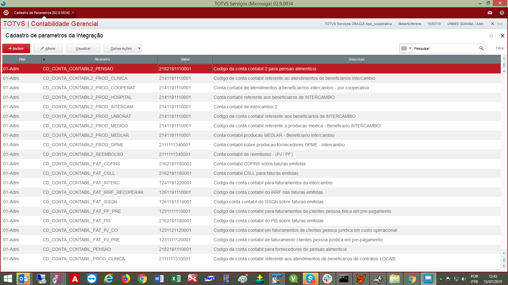

**Parâmetros utilizados na integração**

Foi customizada a tabela Z99030 no ERP para que sejam feitos cadastros de parâmetros auxiliares para serem utilizados na integração do SGU 2.0 para ERP. Esses parâmetros ficam disponíveis para os usuários do sistema e eles pode fazer as modificações que se fizerem necessária.

Inicialmente está liberada apenas no módulo da contabilidade gerencial, em " Atualizações \ Integração SGU 2.0 \ Cadastro de Parametros", conforme print de tela abaixo:

Obs. Foi criada função onde é passado o "parâmetro" e ela devolve conteúdo do valor definido no cadastro. Essa função é utilizada em vários programas da integração. Para ver o código da função (UFFIN001.prw) acesse [aqui](https://labs.unimedgoiania.coop.br/ti/setsis/desenvolvimento/protheus/protheus-unimed/blob/master/ProjetoHOMOLOGA/ProjetoSGU%202.0/Financeiro/Fun%C3%A7%C3%B5es/UFFIN001.prw).
