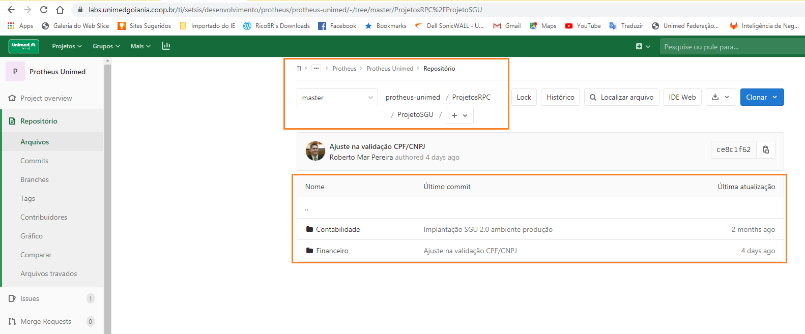

Nesta página são descritas as principais rotinas indispensáveis nos seus respectivos RPOs.  Na época da implantação da integração da integração entre SGU 2.0 com ERP e a volta ERP para SGU 2.0, tivemos o seguinte cenário:

*  **RPO de integração do SGU 2.0 para ERP**: **( WS_JOB )**
---

São rotinas utilizadas nos dois RPOs, mas necessariamente devem ser compiladas no RPO do ambiente **"WS_JOB"**, são todos os programas que estão abaixo das pasta "ProjetosRPC\ProjetoSGU", conforme print de tela abaixo:

Obs. As rotinas devem também ser compiladas no RPO "slaves", porque há a possibilidade de serem utilizadas nos menus nos modulos financeiro e contabil.

*  **RPO de integração do ERP para SGU 2.0: ( UNIMED "SLAVES" )**
---

As principais rotinas indispensáveis nesse RPO são os pontos de entrada, abaixo a lista completa do PEs:

**FINANCEIRO - CONTAS À RECEBER**

| NOME PONTO ENTRADA | DOCUMENTAÇÃO TÉCNICA TOTVS																			   |
| ------------------ | ------------------------------------------------------------------------------------------------------- |
| FA040INC			 | https://tdn.totvs.com.br/display/public/mp/FA040INC+-+Valida+dados+--+11845							   |
| FA040DEL			 | http://tdn.totvs.com/display/public/mp/FA040DEL+-+Executa+rotinas+personalizadas+--+11842			   |
| FA040GRV			 | http://tdn.totvs.com/pages/releaseview.action?pageId=6071098											   |
| SACI008			 | https://tdn.totvs.com/pages/releaseview.action?pageId=6071312										   |
| FA070CA2			 | https://tdn.totvs.com/display/public/mp/FA070CA2+-+Cancela+baixas+--+11875							   |
| F450SE5			 | https://tdn.totvs.com/pages/releaseview.action?pageId=6071066										   |
| UFFIN007			 | Rotina utilizada PE FA040GRV 																		   |

**FINANCEIRO - CONTAS À PAGAR**

| NOME PONTO ENTRADA | DOCUMENTAÇÃO TÉCNICA TOTVS																			   |
| ------------------ | ------------------------------------------------------------------------------------------------------- |
| F450SE2C			 | https://tdn.totvs.com/display/public/mp/F450SE2C+-+Grava+dados+complementares+--+11805				   |
| F340SE5			 | https://tdn.totvs.com/pages/releaseview.action?pageId=145359536										   |
| FA050B01			 | https://tdn.totvs.com/pages/releaseview.action?pageId=6071104										   |
| FA080PE			 | https://tdn.totvs.com/pages/releaseview.action?pageId=6071145										   |
| FA050FIN			 | https://tdn.totvs.com/display/public/PROT/FA050FIN+-+Tratamento+dos+dados+no+Contas+a+Pagar+--+11854	   |
| FA080OWN			 | https://tdn.totvs.com/display/public/mp/FA080OWN+-+Cancela+contas+a+pagar+--+11893					   |
| FA090TX			 | https://tdn.totvs.com/pages/releaseview.action?pageId=6071158										   |
| FA050INC			 | https://tdn.totvs.com/pages/releaseview.action?pageId=544708750										   |
| F090SE5			 | https://tdn.totvs.com/pages/releaseview.action?pageId=145359875										   |

**CONTABILIDADE**

| NOME PONTO ENTRADA | DOCUMENTAÇÃO TÉCNICA TOTVS																			   |
| ------------------ | ------------------------------------------------------------------------------------------------------- |
| CTBA20CT			 | https://tdn.totvs.com/display/public/PROT/CTBA20CT+-+Cadastro+de+contas+--+10974						   |
